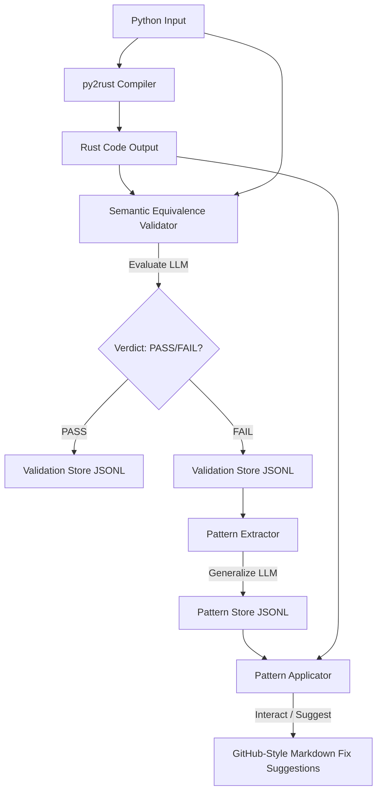

# py2rust

[](https://pypi.org/project/py2rust/)
[](https://pypi.org/project/py2rust/)
[](https://pypi.org/project/py2rust/)
[](LICENSE)
[](https://www.rust-lang.org)
[](https://github.com/djmahe4/py2rust/actions/workflows/ci.yml)

A **Python-to-Rust subset compiler** built following formal compiler design principles: frontend, middle-end, and backend, with clear separation of concerns.

## Overview

`py2rust` translates a strictly defined, statically typed subset of Python into clean, safe, zero-unsafe Rust code.

**Pipeline:**
```
Python Source → Python AST → Custom AST → Symbol Table + Semantic Analysis
    → Type Checking & Inference → High-Level IR → Rust Code Generation → Formatted Rust
```

## 📖 Documentation

*   **📘 [Developer & User Guide](docs/user_guide.md)** — A clean, clear, and comprehensive developer guide covering installation, CLI usage, valid syntax subsets, interop plugins, and error troubleshooting.
*   **🎓 Academic Reference Modules**:
    *   **[Module 1: Lexical Analysis & Subset Definition](docs/module1_intro_and_lexical_analysis.md)** — Explores the compiler phase model, token specifications, and explicitly rejected syntax.
    *   **[Module 2: Syntax Analysis & Recursive Descent Parsing](docs/module2_syntax_analysis.md)** — Covers custom AST hierarchy, error recovery strategies, and recursive descent dispatch tables.
    *   **[Module 3: Bottom-Up LALR(1) Parsing Alternatives](docs/module3_bottom_up_parsing.md)** — Analyzes grammar transformation, shift-reduce conflicts, and lookahead propagation.
    *   **[Module 4: Translation, Symbol Tables & ICG](docs/module4_translation_and_icg.md)** — Details type checking, bidirectional type inference, collections mapping, and multi-module scopes.
    *   **[Module 5: Optimization & Idiomatic Rust Codegen](docs/module5_code_optimization_and_generation.md)** — Documents code optimization, RAII scoped resource lowering, and suspended coroutine state machines.

## Supported Python Subset

### ✅ Supported Features

#### Basic Constructs
- Function definitions with **mandatory** type hints on all parameters and return type
- Variable declarations with type annotations or inferable literals
- `async def` and `await` for asynchronous programming
- `return` statements
- `print(expr)` supports simple arguments and interpolated strings
- f-strings: `f"Value: {val:.2f}"` mapped to Rust `format!` macro
- `pass` statements and `...` (Ellipsis)
- Limited imports: `typing` and `enum` modules are ignored to support standard Python type declarations
- **Repository-Scale Imports**: Full support for absolute and relative cross-module imports (e.g. `from .module import symbol` or `import module`)
- **`sys.path` Resolution**: Custom search paths (injectable via `ProjectConfig` or CLI flags) prioritizing search scopes for absolute imports

#### Primitive Types
- `int` → `i32`
- `float` → `f64`
- `bool` → `bool`
- `str` → `String`

#### Operators
- Arithmetic: `+`, `-`, `*`, `/`, `//`, `%`
- Comparison: `==`, `!=`, `<`, `<=`, `>`, `>=`
- Boolean logic: `and`, `or`, `not`
- Augmented assignment: `+=`, `-=`, `*=`, `/=`, `//=`, `%=`

#### Control Flow
- `if` / `elif` / `else`
- `while` loops
- General iterable iteration (e.g. `for x in collection:`) and `range()`-based iteration
- `break` and `continue`
- Generators via `yield` and `yield from` (desugared to state-machine `dyn Iterator` structs)
- Context managers via `with` and `async with` (lowered to scoped blocks with RAII-based automatic resource cleanup/unlocking)

#### Collections
- Homogeneous lists: `list[int]`, `list[float]`, etc. → `Vec<T>`
- Dicts: `dict[K, V]` → `HashMap<K, V>`
- String indexing and slicing
- Dict membership: `key in dict`, `key not in dict`

#### File Operations
- `open(path)` and `open(path, mode)` → `FileHandle`
- Methods: `.read()`, `.readline()`, `.write()`, `.close()`, `.tell()`, `.seek()`

#### Classes (with limitations)
- Class definitions with type-annotated fields
- `__init__` constructors
- Instance methods with `self` parameter
- Field access via `self.field`
- Method calls via `obj.method(args)`
- Single inheritance (base class)
- Multiple inheritance (discovery and member flattening)
- Protocols: `typing.Protocol` mapped to Rust `trait`
- Method overloading by argument count
- Automatic structural matching for trait implementations
- Decorators on classes/methods: `@staticmethod`, `@classmethod`, `@property`, `@abstractmethod`, `@override`, `@dataclass`

#### Python Interoperability (Plugins)
- Call external Python libraries (NumPy, OpenCV, PyTorch, etc.) via `ExternalObject` wrapper
- Automatic generation of Rust bindings for Python objects
- Support for calling Python methods, accessing attributes, and top-level functions
- **Virtual Environment (venv) support** with runtime `sys.path` injection
- Mocking system to enable type checking of external library calls

#### 🤖 Semantic Validation & Pattern Learning


- **Closed-Loop Verification**: Empirically validates generated Rust translation output against input Python source using local LLM models (e.g. `deepseek-coder`).
- **Platform-Aware Context Gathering**: Securely retrieves semantic and surrounding symbol context using native platforms (e.g. `rg`/`grep`) with recursive fallback parsing.
- **Append-Only JSONL Storage**: Logs robust validation history (`.py2rust/validation_history.jsonl`) and Generalized Improvement Patterns (`.py2rust/patterns.jsonl`).
- **Premium Suggestion Engine**: Recommends colorized, highly descriptive, interactive GitHub-style Markdown code modifications without altering user source code.
- **🛠️ Compiler & Cargo Error Recovery**: Automatically intercepts downstream `cargo check` compile errors (lifetime, borrowing, syntax) and py2rust frontend compilation exceptions (`CompilerError`), leveraging local Ollama/Gemini validation models to semantically explain the error and suggest fixes.
- **💻 Interactive HITL Triage Dashboard**: Halts compilation on errors when `--review-failures` is enabled, presenting an interactive console triage dashboard to inspect diagnostics, view explanations, modify source code on the fly (`[e] Edit`), retry compilation (`[r] Retry`), or skip/abort.

### ❌ Forbidden Features (raises `UnsupportedFeatureError`)

#### Language Features
- Missing type hints on function parameters/returns
- Dynamic typing, `Any`, `typing.Any`
- `eval`, `exec`, `globals`, `locals`
- Arbitrary/Custom decorators (except supported ones like `@staticmethod`, `@classmethod`, `@property`, `@abstractmethod`, `@override`, `@dataclass`)
- Third-party imports without wrappers or mocking (only local workspace/sys_path modules, or mocked packages are resolved)
- Ternary expressions (`x if cond else y`)
- Multiple inheritance (discovery and member flattening are supported, but arbitrary nested dynamic base structures are restricted)
- **Circular/Recursive import cycles** (raises `ValueError` via Module Graph cycle detection)
- **Circular/Recursive struct/class field layouts without indirection** (raises `SemanticError` in type checking to prevent un-sized/infinite Rust types)

#### Class Features
- `self` without type annotation on first parameter (Python requirement)
- `__new__` constructor
- Multiple constructors with same arity (method overloading by argument count is supported, but arities must be distinct)
- Keyword arguments in function/method calls

#### Syntax Restrictions
- Only single-target assignments (multiple assignments like `a = b = c` are not supported, but tuple/list unpacking destructuring like `x, y = z` is supported)
- Only simple comparisons (no chained comparisons like `a < b < c`)
- No walrus operator (`:=`)

## Type Mapping

| Python | Rust | Description |
|---|---|---|
| `None` / `NoneType` | `()` | Unit type |
| `int` | `i32` | 32-bit signed integer |
| `float` | `f64` | 64-bit float |
| `bool` | `bool` | Boolean |
| `str` | `String` | Owned string |
| `list[T]` | `Vec<T>` | Dynamic array |
| `dict[K, V]` | `HashMap<K, V>` | Hash map |
| `set[T]` | `HashSet<T>` | Hash set |
| `tuple[T1, T2]` | `(T1, T2)` | Fixed-size tuple |
| `Optional[T]` / `T \| None` | `Option<T>` | Option type |
| `Union[A, B]` / `A \| B` | Custom `enum` | Custom algebraic data type |
| `deque[T]` | `VecDeque<T>` | Double-ended queue |
| `heap[T]` / `heapq` | `BinaryHeap<Reverse<T>>` | Min-heap wrapper |
| `Iterator[T]` / `Iterable[T]` | `Box<dyn Iterator<Item = T>>` | Trait object iterator |
| `Generator[Y, S, R]` | `Box<dyn Iterator<Item = Y>>` | State-machine iterator |
| `open` (File) | `FileHandle` | Scoped file handle |
| `ClassName` | `ClassName` | Custom struct/class |

## Repository-Scale Stress Testing & Validation

`py2rust` features a dedicated multi-module repository stress testing framework to ensure compiler robustness and fail-fast guarantees against invalid inputs.

Supported stress test assertions include:
- **Relative Import Boundary Violations**: Verifies boundary violations during relative imports.
- **Undefined Import Symbols**: Catch unresolved cross-module symbol names immediately.
- **Cross-Module Attribute and Function Validation**: Statically inspects attribute and method call namespaces across different modules.
- **Cross-Module Constructor Arity Checking**: Ensures constructor arguments are validated against the defining class signature across modules.
- **Circular Import Detection**: Gracefully detects and breaks infinite import loops.
- **Alias Conflict Verification**: Confirms multiple identically named imports with unique aliases do not cause namespace collisions.
- **`sys.path` Mismatches**: Asserts that absolute imports referencing invalid paths outside of specified search scopes fail.
- **Nested Import Name Error Propagation**: Verifies that transitive import errors inside deep dependencies bubble up cleanly.
- **Circular Struct Field Layouts**: Rejects infinite-size recursive definitions at type checking time.

Run stress tests:
```bash
pytest py2rust/tests/test_repo_stress.py -v
```

## Installation

## Installation

You can install py2rust directly from PyPI:

```bash
pip install py2rust
```

Or, to get the latest development version directly from GitHub:

```bash
pip install git+https://github.com/djmahe4/py2rust.git
```

Requires Python ≥ 3.11 and Rust/`rustc` (stable) for `--verify`.

## Usage

```bash
# Basic compilation (output to stdout)
py2rust input.py

# Compile to file
py2rust input.py -o output.rs

# Emit intermediate representations
py2rust input.py --emit-ast      # Print the custom AST
py2rust input.py --emit-ir       # Print the IR

# Type-check only, no code generation
py2rust input.py --check-only

# Verify generated Rust compiles with rustc
py2rust input.py -o output.rs --verify

# Mock external imports (skips undefined module errors)
py2rust input.py --mock-mode

# Specify custom plugin directory
py2rust input.py --plugin-path ./my_plugins

# Verbose output
py2rust input.py -v

# Disable rustfmt formatting
py2rust input.py --no-format

# Enable semantic equivalence validation
py2rust input.py --validate

# Enable strict equivalence validation (aborts compilation on failures)
py2rust input.py --validate --strict-validation

# Specify local Ollama model to use for checks (defaults to deepseek-coder)
py2rust input.py --validate --ollama-model llama3

# Enable active pattern learning and suggest fixes based on past failures
py2rust input.py --validate --learn-patterns --apply-learned-patterns

# Enable interactive error recovery and triage dashboard on compiler/cargo failure
py2rust input.py --validate --review-failures
```

### Environment Variables

| Variable | Description |
|----------|-------------|
| `PY2RUST_VENV` | Path to the Python virtual environment for the generated Rust binary. |
| `PYO3_USE_ABI3_FORWARD_COMPATIBILITY` | Set to `1` when building for Python 3.13+ using older `pyo3` versions. |

## Examples

To test examples:
```bash
python scripts/test_examples.py
```

### Simple Math

**Input (`examples/simple_math.py`):**
```python
def add(x: int, y: int) -> int:
    return x + y

def main() -> int:
    a: int = 10
    b: int = 5
    result: int = add(a, b)
    print(result)
    return 0
```

**Output (`examples/simple_math.rs`):**
```rust
fn add(x: i32, y: i32) -> i32 {
    return x + y;
}

fn main() -> i32 {
    let a: i32 = 10;
    let b: i32 = 5;
    let result: i32 = add(a, b);
    println!("{}", result);
    return 0;
}
```

### Fibonacci

**Input (`examples/fibonacci.py`):**
```python
def fibonacci(n: int) -> int:
    if n <= 0:
        return 0
    elif n == 1:
        return 1
    else:
        a: int = 0
        b: int = 1
        for i in range(2, n):
            temp: int = a + b
            a = b
            b = temp
        return b

def main() -> int:
    print(fibonacci(10))
    return 0
```

### Classes

**Input (`examples/classes.py`):**
```python
class Point:
    x: int = 0
    y: int = 0
    
    def __init__(self, x: int, y: int) -> None:
        self.x = x
        self.y = y
    
    def get_x(self) -> int:
        return self.x
    
    def distance_to(self, other: int) -> int:
        dx: int = self.x - other
        dy: int = self.y - 0
        return dx + dy

def main() -> int:
    p: Point = Point(3, 4)
    x: int = p.get_x()
    d: int = p.distance_to(0)
    return x + d
```

**Output (`examples/classes.rs`):**
```rust
struct Point {
    x: i32,
    y: i32,
}

impl Point {
    fn new(x: i32, y: i32) -> Self {
        Point { x, y }
    }
    fn get_x(self) -> i32 {
        self.x
    }
    fn distance_to(self, other: i32) -> i32 {
        let dx: i32 = self.x - other;
        let dy: i32 = self.y - 0;
        return dx + dy;
    }
}

fn main() -> i32 {
    let p: Point = Point::new(3, 4);
    let x: i32 = p.get_x();
    let d: i32 = p.distance_to(0);
    return x + d;
}
```

### Lists

**Input (`examples/lists.py`):**
```python
def sum_list(nums: list[int]) -> int:
    total: int = 0
    for n in range(len(nums)):
        total = total + nums[n]
    return total

def main() -> int:
    numbers: list[int] = [1, 2, 3, 4, 5]
    result: int = sum_list(numbers)
    print(result)
    return 0
```

### Dictionaries

**Input (`examples/dicts.py`):**
```python
def main() -> int:
    scores: dict[str, int] = {"alice": 90, "bob": 85}
    scores["charlie"] = 95
    alice_score: int = scores["alice"]
    print(alice_score)
    return 0
```

### File Operations

**Input (`examples/files.py`):**
```python
def main() -> int:
    f = open("test.txt", "w")
    f.write("Hello, World!")
    f.close()
    
    f = open("test.txt", "r")
    contents = f.read()
    print(contents)
    f.close()
    return 0
```

### Python Interoperability (Numpy & OpenCV)

`py2rust` can generate wrappers for external Python libraries using the `--mock-mode` flag.

**Input (`examples/big_lib_test.py`):**
```python
import numpy as np
import cv2

def test_numpy() -> None:
    arr = np.array([1, 2, 3])
    print(f"Array: {arr}")
    print(f"Mean: {np.mean(arr)}")

def test_opencv() -> None:
    print(f"OpenCV Version: {cv2.__version__}")
    img = np.zeros((10, 10, 3))
    cv2.imshow("Py2Rust OpenCV Test", img)
    cv2.waitKey(1)
    cv2.destroyAllWindows()

def main() -> None:
    test_numpy()
    test_opencv()
```

**Compilation & Run:**
```bash
# 1. Compile with mock mode
py2rust examples/big_lib_test.py -o main.rs --mock-mode

# 2. Run with venv set
export PY2RUST_VENV=/path/to/your/venv
cargo run
```

## Project Structure

```
py2rust/
├── py2rust/
│   ├── __init__.py
│   ├── main.py              # compile_file() pipeline
│   ├── cli.py               # argparse CLI entry point
│   ├── config.py            # CompilerConfig dataclass
│   │
│   ├── frontend/
│   │   ├── ast_nodes.py     # Frozen dataclass AST nodes with source location
│   │   └── parser.py        # Python ast → custom AST, rejects unsupported nodes
│   │
│   ├── middleend/
│   │   ├── symbol_table.py  # Scoped symbol table with class support
│   │   ├── type_checker.py  # Strict bidirectional type checker
│   │   ├── type_inferencer.py # Type inference from literals
│   │   └── ir_builder.py    # Custom AST → IR, final semantic validation
│   │
│   ├── ir/
│   │   └── ir_nodes.py      # Strongly-typed IR nodes (frozen dataclasses)
│   │
│   ├── project/             # Repository-scale multi-module compilation
│   │   ├── project_config.py # Multi-module project compiler config (sys_path)
│   │   ├── repo_compiler.py # Core repository compiler driver
│   │   ├── module_graph.py  # Module dependency graph with cycle detection
│   │   ├── import_resolver.py # Absolute/relative import resolver with sys_path
│   │   ├── package_scanner.py # Discovers all python files in workspace
│   │   └── build_cache.py   # Caches metadata for incremental compilation
│   │
│   ├── learning_system/     # Closed-loop semantic pattern learning system
│   │   ├── validation/      # Validates semantic equivalent output using LLM
│   │   └── learning/        # Pattern generalizations & interactive markdown suggestions
│   │
│   ├── plugins/
│   │   ├── __init__.py
│   │   └── python_wrapper_plugin.py # Interop logic for external libs
│   │
│   ├── backend/
│   │   ├── rust_codegen.py  # IR → idiomatic Rust code
│   │   └── rust_formatter.py # rustfmt integration
│   │
│   ├── utils/
│   │   ├── errors.py        # CompilerError hierarchy
│   │   ├── logger.py        # Logging setup
│   │   └── visitor.py       # Generic visitor pattern
│   │
│   └── tests/               # pytest test suite (353 tests)
│
├── examples/                # Input/output examples
└── pyproject.toml
```

## Running Tests

```bash
python -m pytest py2rust/tests/ -v
```

## Error Messages

`py2rust` provides rich error messages with file location, source snippet, and suggestions:

```
UnsupportedFeatureError: example.py:3:1: Keyword arguments not supported
  | def foo(x=1)
  |           ^
  hint: Use positional arguments instead
```

```
SemanticError: example.py:5:10: Undefined variable: 'y'
  |     return y
  |          ^
```
