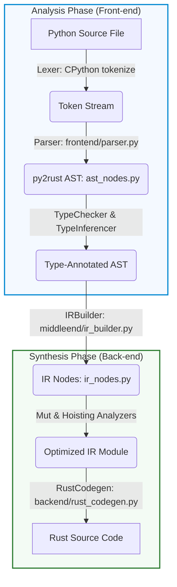
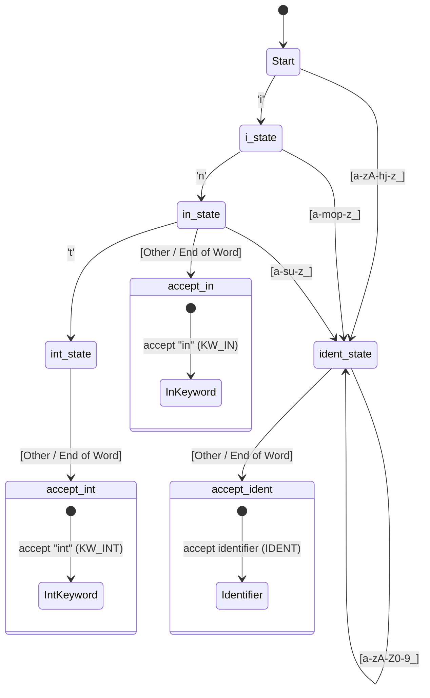

# Module 1: Introduction to Compilers and Lexical Analysis

> A technical study guide grounded in the **py2rust** compiler implementation  
> _Compiler Design — Academic Reference Document_

---

## Table of Contents

1. [Executive Summary](#executive-summary)
2. [Analysis of the Source Program](#1-analysis-of-the-source-program)
   - [Analysis and Synthesis Phases](#analysis-and-synthesis-phases)
   - [Phases of a Compiler](#phases-of-a-compiler)
3. [Compiler Writing Tools](#2-compiler-writing-tools)
4. [Bootstrapping](#3-bootstrapping)
5. [Lexical Analysis](#4-lexical-analysis)
   - [Role of the Lexical Analyser](#role-of-the-lexical-analyser)
   - [Input Buffering](#input-buffering)
   - [Specification of Tokens](#specification-of-tokens)
   - [Recognition of Tokens](#recognition-of-tokens)
6. [py2rust: Complete Phase Map](#py2rust-complete-phase-map)
7. [Summary Table](#summary-table)
8. [Glossary](#glossary)

---

## Executive Summary

A **compiler** translates a source program written in a high-level language into an equivalent target program, typically in a lower-level language. This module covers the high-level architecture — the phases a source program passes through — and the very first phase: **lexical analysis**, which converts a stream of characters into a stream of tokens.

**py2rust** is a source-to-source compiler (transpiler) that translates a typed subset of Python into Rust. It is an ideal teaching example because:

1. **Every classical compiler phase is present** — lexical analysis, parsing, semantic analysis, IR generation, optimization, and code generation.
2. **The source and target are both high-level languages**, making each phase's output human-readable and easy to inspect via `--emit-ast` and `--emit-ir` flags.
3. **It is written in Python**, so the implementation language itself is the object of study.

---

## 1. Analysis of the Source Program

### Analysis and Synthesis Phases

A compiler's work divides into two major halves:

| Half | Phase | Output |
|------|-------|--------|
| **Analysis** (front-end) | Lexical Analysis | Token stream |
| | Syntax Analysis | Parse tree / AST |
| | Semantic Analysis | Annotated AST |
| **Synthesis** (back-end) | IR Generation | Intermediate Representation |
| | Optimization | Optimized IR |
| | Code Generation | Target code |

The **analysis** phase breaks the source into its constituent parts and extracts meaning — it is language-specific. The **synthesis** phase constructs the target program — it is target-specific. The IR is the language-neutral bridge between them.

**py2rust maps directly onto this model:**



### Phases of a Compiler

A classical compiler has six phases:

#### Phase 1: Lexical Analysis (Scanning)
Reads the raw character stream and groups characters into **tokens** — the smallest meaningful units (keywords, identifiers, literals, operators).

**py2rust:** Delegated to CPython's built-in tokeniser via `ast.parse()`. Python's tokenizer handles all whitespace, indentation, string quoting, and comment stripping.

#### Phase 2: Syntax Analysis (Parsing)
Reads the token stream and builds a **parse tree** / AST that captures grammatical structure.

**py2rust:** Two layers.
- CPython's `pegen` LALR parser produces `ast.Module`.
- `py2rust/frontend/parser.py` translates `ast.Module` into py2rust's own typed AST.

#### Phase 3: Semantic Analysis
Checks that the program is **meaningful**: type checking, scope resolution, undefined variable detection.

**py2rust:** `py2rust/middleend/type_checker.py` and `type_inferencer.py`. Catches type mismatches, missing annotations, and invalid field access.

#### Phase 4: Intermediate Code Generation
Translates the annotated AST into an **Intermediate Representation** — a simplified, language-neutral form.

**py2rust:** `py2rust/middleend/ir_builder.py` produces `IRModule` containing `IRFunction`, `IRClassDefinition`, `IRBinOp`, etc., defined in `py2rust/ir/ir_nodes.py`.

#### Phase 5: Code Optimization
Improves the IR for performance (speed, size) without changing semantics.

**py2rust:** Structural optimisations in `rust_codegen.py` (e.g., `_collect_mutated_vars` for `mut` elision, `_strip_parens` for clean output). Heavy machine-code optimization delegated to `rustc`/LLVM.

#### Phase 6: Code Generation
Translates the (optimized) IR into the target language.

**py2rust:** `py2rust/backend/rust_codegen.py` — 2 800-line `RustCodegen` class that emits idiomatic Rust source text.

#### The compile_file Pipeline

`py2rust/main.py` is the definitive proof that all six phases are present:

```python
# py2rust/main.py — every phase is visible as a function call
source = source_path.read_text()          # Phase 0: read source

module = parse(source, filename)          # Phase 1+2: lex + parse
                                          #   (ast.parse inside, then Parser)
ir_module = build_ir(module, filename,    # Phase 3+4: semantic + IR gen
                     source_lines, config)

rust_code = generate_rust(ir_module,      # Phase 5+6: optimize + codegen
                          config=config)

if config.format_output:
    rust_code = format_rust(rust_code)    # (bonus) rustfmt post-processing

output_path.write_text(rust_code)         # emit target program
```

#### Supported Decorators and Meta-programming Constructs
The `py2rust` compiler maps Python's structural decorator tags directly to corresponding idiomatic Rust semantic constructs:
*   `@staticmethod`: Lowered to Rust **associated functions** defined within the type's implementation block (`impl TypeName`) lacking the `self` parameter context.
*   `@dataclass`: Lowers to a native Rust `struct` definition with direct parameterization, automatic creation of constructor functions, and clean data layouts.
*   `@abstractmethod`: Represents abstract class boundaries, translating Python classes acting as interfaces directly into Rust `trait` specifications.

#### Explicitly Rejected Features
For semantic clarity and translation determinism, `py2rust` enforces a strict subset of Python, rejecting structures that break clean Rust-equivalent type mappings:
1.  **Ternary Expressions (`x if cond else y`)**: Disallowed to enforce structured, explicit branch definitions. Encountering `ast.IfExp` at the parser boundary triggers an early compiler termination by throwing an `UnsupportedFeatureError`:
    > [!IMPORTANT]
    > `UnsupportedFeatureError(..., "Ternary expressions are not supported in py2rust. Use standard if-else blocks instead.")`
2.  **Multiple Structural Inheritance / Custom Metaclasses**: Rejected to ensure a clean, deterministic single-trait interface matching Rust's object model.

---


## 2. Compiler Writing Tools

Compiler writing tools automate the construction of compiler phases from formal specifications.

### Classical Tools

| Tool | Phase | Description |
|------|-------|-------------|
| **Lex / Flex** | Lexical Analysis | Generates a lexer from regex specifications |
| **Yacc / Bison** | Parsing | Generates an LALR(1) parser from BNF grammar |
| **LLVM** | Code Generation | Reusable backend for many languages |
| **ANTLR** | Lexer + Parser | Generates LL(*) parsers from grammar files |

### py2rust's Tool Choices

py2rust is itself built with compiler writing tools — it just uses **Python-native** equivalents:

| py2rust Tool | Phase | Classical Equivalent |
|-------------|-------|---------------------|
| `ast` stdlib module | Lex + Parse | Lex + Yacc combined |
| `tokenize` stdlib module | Lexical analysis (available) | Lex/Flex |
| `dataclasses` | AST/IR node definitions | IDL / schema |
| `rustfmt` (via subprocess) | Output formatting | Not classical — Rust-specific |
| `cargo check` (via subprocess) | Verification | Linker / assembler check |

**`ast` as a compiler writing tool:**

```python
# py2rust/frontend/parser.py:151-161
def parse(self) -> Module:
    try:
        tree = ast.parse(self.source, filename=self.filename)  # ← compiler tool
    except SyntaxError as e:
        raise ParseError(
            message=str(e.msg),
            filename=self.filename,
            line=e.lineno or 0,
            ...
        )
```

`ast.parse` is a complete **lexer + parser** tool. It runs CPython's tokenizer and LALR(1) `pegen` parser and returns a fully-structured AST. py2rust uses it as a "tool" in precisely the way that Lex and Yacc were used in traditional compilers.

**`CompilerConfig` as a tool-configuration layer:**

```python
# py2rust/config.py
@dataclass
class CompilerConfig:
    input_file:    str  = ""
    output_file:   str  = ""
    emit_ast:      bool = False   # debug: print AST (like yacc's --debug)
    emit_ir:       bool = False   # debug: print IR
    check_only:    bool = False   # run semantic analysis only
    verify:        bool = False   # invoke cargo check (external tool)
    format_output: bool = True    # invoke rustfmt (external tool)
    mock_mode:     bool = False   # allow unresolved imports
    async_runtime: AsyncRuntime = AsyncRuntime.TOKIO
```

The `--emit-ast` and `--emit-ir` flags echo the debug introspection features baked into tools like Bison (`--verbose`) and LLVM (`opt --print-after-all`).

---

## 3. Bootstrapping

**Bootstrapping** is the process of using a language to compile itself. It is the classic "chicken and egg" problem in compiler construction.

### The Bootstrapping Problem

```
Problem:
  - To compile language L, you need a compiler for L.
  - The first compiler for L must be written in another language X.
  - Then you rewrite the compiler in L itself and compile it with the X-written version.
  - The result: a compiler for L, written in L, compiled by L.
```

### T-Diagrams

A **T-diagram** (Tombstone diagram) represents a compiler's triple: (source language, target language, implementation language):

```
      ┌─────┬─────┐
      │ S   │  T  │
      └──┬──┘     │
         │   L    │
         └────────┘

Means: "Compiler from S to T, written in L"
```

**CPython bootstrap chain:**
```
Step 1:
  ┌──────┬──────┐     ┌──────┬──────┐
  │  C   │  x86 │  +  │Python│  x86 │
  └──┬───┘      │     └──┬───┘      │
     │   C      │        │  Python  │
     └──────────┘        └──────────┘
   (C compiler)        (CPython interpreter)

Step 2:
  ┌──────┬──────┐
  │Python│ py2rust IR │
  └──┬───┘            │
     │    Python       │
     └─────────────────┘
   (py2rust: Python→Rust, written in Python)
```

### py2rust and Bootstrapping

py2rust is written in **Python** and compiles **Python** to Rust. This creates an interesting bootstrapping question:

> Could py2rust compile itself?

Currently, **no** — py2rust only supports a typed *subset* of Python (no decorators, all parameters must be annotated, no dynamic dispatch). py2rust itself uses many of these unsupported features (e.g., `Optional` parameters without `int`-only types, `dataclass` complexity).

This is the classic **Stage 0 → Stage 1** bootstrapping problem:

| Stage | What it is |
|-------|-----------|
| **Stage 0** | py2rust written in Python, run via CPython |
| **Stage 1** | py2rust compiled by itself to Rust (not yet reached) |
| **Stage 2** | py2rust in Rust compiles py2rust source again (full bootstrap) |

**The `--verify` flag** is py2rust's current verification step: it invokes `cargo check` to confirm that generated Rust code is correct, analogous to how a bootstrapping compiler verifies its own output.

```python
# py2rust/main.py
if config.verify and config.output_file:
    result = subprocess.run(
        ['cargo', 'check'],            # external compiler tool
        cwd=tmp_dir_path,
        capture_output=True, text=True
    )
    if result.returncode != 0:
        print(f"Cargo verification failed:\n{result.stderr}", ...)
        return False
    logger.info("Cargo verification passed")
```

---

## 4. Lexical Analysis

### Role of the Lexical Analyser

The **lexical analyser** (scanner/lexer) is the first phase of the compiler. Its role is to:

1. Read the source character stream left-to-right
2. Group characters into **lexemes** (raw character sequences)
3. Produce **tokens** (typed, structured representations of lexemes)
4. Strip **whitespace** and **comments** (irrelevant to syntax)
5. Pass tokens one-by-one to the parser on demand

```
Source characters:  d e f   a d d ( x :   i n t )   - >   i n t :
                    ───────────────────────────────────────────────
Tokens:             KW_DEF  NAME  LPAREN  NAME  COLON  NAME  RPAREN  ARROW  NAME  COLON
                    "def"   "add" "("     "x"   ":"    "int" ")"     "->"   "int" ":"
```

The lexer separates the **character-level** concerns from the **grammar-level** concerns dealt with by the parser.

### Input Buffering

Scanning a file character-by-character is slow. Real lexers use **input buffering** to read large blocks at once.

#### Two-Buffer Scheme (Theory)

The classic two-buffer scheme uses two buffers of size `N` (e.g., 4096 bytes). Two pointers are maintained:

```
Buffer 1          │ Buffer 2
──────────────────┼──────────────────
 d e f   a d d    │ (   x   :   i n t
 ↑                │
 lexemeBegin, forward
```

- **`lexemeBegin`**: start of the current lexeme
- **`forward`**: scans ahead to find the end of the token

When `forward` reaches the end of a buffer, the other buffer is refilled from disk. This allows lookahead without re-reading from disk.

#### Sentinel Characters

To avoid checking for buffer boundaries on every character, a special **sentinel** (e.g., `EOF` = `\0`) is placed at the end of each buffer. The inner scan loop only needs to check `if char == EOF`.

#### py2rust's Approach

py2rust delegates input buffering entirely to CPython's `ast.parse()` and the operating system. The source is read in one shot:

```python
# py2rust/main.py
source = source_path.read_text()    # OS-level buffered I/O reads whole file
```

CPython's own tokenizer (`Lib/tokenize.py` and the C-level `Python/tokenize.c`) implements a sophisticated buffered scanner with two-pointer lookahead for handling multi-character tokens like `**`, `//`, `->`, `:=`, and string prefixes (`r"..."`, `b"..."`, `f"..."`).

### Specification of Tokens

Tokens are specified using **regular expressions**. A regular expression describes the set of strings (lexemes) that match a token class.

#### Regular Expression Operators

| Operator | Meaning | Example |
|----------|---------|---------|
| `a` | Literal character `a` | `a` matches "a" |
| `a\|b` | Alternation | `a\|b` matches "a" or "b" |
| `ab` | Concatenation | `ab` matches "ab" |
| `a*` | Kleene star (0 or more) | `a*` matches "", "a", "aa", ... |
| `a+` | One or more | `a+` matches "a", "aa", ... |
| `a?` | Optional | `a?` matches "" or "a" |
| `[a-z]` | Character class | `[a-z]` matches any lowercase letter |
| `.` | Any character | `.` matches any single char |

#### Python Token Specifications (Regular Expressions)

| Token | Regex | Example |
|-------|-------|---------|
| **Integer literal** | `[0-9]+` | `42`, `0`, `1000` |
| **Float literal** | `[0-9]+\.[0-9]*\|[0-9]*\.[0-9]+` | `3.14`, `0.5` |
| **Identifier / Keyword** | `[a-zA-Z_][a-zA-Z0-9_]*` | `foo`, `def`, `class` |
| **String literal** | `"[^"]*"\|'[^']*'` | `"hello"`, `'world'` |
| **f-string** | `f"[^"]*"\|f'[^']*'` | `f"x={x}"` |
| **Operator** | `\+\|-\|*\|/\|//\|%\|==\|!=\|<=\|>=\|<\|>` | `+`, `//`, `==` |
| **Arrow** | `->` | `-> int` (return type) |
| **Colon** | `:` | `x: int` |
| **INDENT/DEDENT** | Whitespace counting (context-sensitive) | Block start/end |

**Keyword vs. Identifier:** Keywords like `def`, `class`, `if`, `for`, `return` match the same regex as identifiers. The lexer resolves this conflict by checking the matched string against a **reserved word table**:

| Matched string | Token |
|----------------|-------|
| `def` | `KW_DEF` |
| `class` | `KW_CLASS` |
| `if` | `KW_IF` |
| `add` | `IDENTIFIER("add")` |

#### py2rust's Token Specification via `_BINOP_MAP` and `_CMP_MAP`

Although py2rust does not write its own regex-based tokenizer, its **operator maps** are the functional equivalent of a token specification table:

```python
# py2rust/frontend/parser.py:92-119
_BINOP_MAP = {
    ast.Add:      "+",    # regex: \+
    ast.Sub:      "-",    # regex: \-
    ast.Mult:     "*",    # regex: \*
    ast.Div:      "/",    # regex: /(?!/)
    ast.FloorDiv: "//",   # regex: //
    ast.Mod:      "%",    # regex: %
}

_CMP_MAP = {
    ast.Eq:    "==",      # regex: ==
    ast.NotEq: "!=",      # regex: !=
    ast.Lt:    "<",       # regex: <(?!=)
    ast.LtE:   "<=",      # regex: <=
    ast.Gt:    ">",       # regex: >(?!=)
    ast.GtE:   ">=",      # regex: >=
    ast.Is:    "is",      # keyword
    ast.IsNot: "is not",  # two-keyword compound
}

_AUGOP_MAP = {
    ast.Add:      "+=",
    ast.Sub:      "-=",
    ast.Mult:     "*=",
    ast.Div:      "/=",
    ast.FloorDiv: "//=",
    ast.Mod:      "%=",
}
```

Each entry maps a **CPython AST token class** (produced by CPython's tokenizer) to py2rust's string representation. This is the token recognition table for py2rust's "second-layer" lexical phase.

### Recognition of Tokens

A **finite automaton (FA)** is the machine that implements regex-based token recognition. Each regular expression is converted to a Non-deterministic Finite Automaton (NFA), which is then converted to a Deterministic Finite Automaton (DFA) for efficient scanning.

#### NFA → DFA (Subset Construction)

**Example: recognising `int` or `in` as keywords vs `identifier`**



After subset construction, one DFA handles all three patterns simultaneously. The DFA returns the **longest match** (maximal munch rule).

**Maximal Munch:** The lexer always returns the longest possible token. This is why `//` is floor division, not two `/` tokens; `->` is an arrow, not minus followed by `>`.

#### Python's Specific Lexical Challenges

Python has several lexical features that go beyond standard regular-language tokens:

| Feature | Challenge | Solution |
|---------|-----------|---------|
| **INDENT/DEDENT** | Block structure from whitespace | Indent stack maintained by tokenizer |
| **f-strings** | Embedded expressions inside strings | Re-entrant tokenizer for nested `{}` |
| **Triple-quoted strings** | Multi-line `"""..."""` | State machine with multi-char sentinel |
| **Type comments** | `# type: int` in comments | Special comment scanning |
| **`->` arrow** | Two-character operator | Lookahead: `-` then check next char |

#### py2rust Token Recognition — `_parse_type` as a Mini-Recognizer

py2rust's `_parse_type` method is a **recursive token recognizer** for type annotations. It implements a DFA over AST node types rather than characters:

```python
# parser.py:396-466 (condensed)
def _parse_type(self, node):
    # State 0: What kind of node is this?
    if isinstance(node, ast.Name):
        # State 1: Identifier — check if it's a keyword type
        match node.id:
            case "int":   return IntType()       # token: KW_INT
            case "float": return FloatType()     # token: KW_FLOAT
            case "bool":  return BoolType()      # token: KW_BOOL
            case "str":   return StrType()       # token: KW_STR
            case _:       return ClassType(name=node.id)  # token: IDENTIFIER

    elif isinstance(node, ast.Subscript):
        # State 2: Generic type — need to look at inner name
        if node.value.id in ("list", "List"):    # token: KW_LIST
            elem = self._parse_type(node.slice)  # recurse — inner token
            return ListType(element_type=elem)
        ...

    elif isinstance(node, ast.BinOp) and isinstance(node.op, ast.BitOr):
        # State 3: Union type with | operator (Python 3.10+)
        left  = self._parse_type(node.left)
        right = self._parse_type(node.right)
        return UnionType(variants=...)

    elif isinstance(node, ast.Constant) and node.value is None:
        return UnitType()                        # token: KW_NONE

    raise UnsupportedFeatureError(...)           # DEAD STATE
```

This is a **pattern-matching DFA**: each `isinstance` check is a transition; each `return` is an accepting state; `raise` is the dead state. It mirrors exactly how a classically-built lexer recognizes tokens from a character stream.

---

## py2rust: Complete Phase Map

```mermaid
flowchart TD
    %% Base styling
    classDef default fill:#f9f9f9,stroke:#333,stroke-width:1px;
    classDef phase fill:#e1f5fe,stroke:#0288d1,stroke-width:2px,font-weight:bold;
    classDef data fill:#fff3e0,stroke:#f57c00,stroke-width:1px,stroke-dasharray: 2 2;
    classDef check fill:#efebe9,stroke:#5d4037,stroke-width:2px;
    classDef validation fill:#ede7f6,stroke:#5e35b1,stroke-width:2px;

    %% Nodes
    PySrc[/"Python Source File (.py)"/]:::data
    
    subgraph FrontEnd ["Frontend (Lexical & Syntax Analysis)"]
        Parser[Parser / frontend/parser.py]:::phase
        AST[py2rust AST / frontend/ast_nodes.py]:::data
        
        PySrc -->|ast.parse / CPython Lexer & Parser| Parser
        Parser -->|_parse_stmt / _parse_expr / _parse_type| AST
    end

    subgraph MiddleEnd ["Middle-end (Semantic Analysis & Type Checking)"]
        ImportRes[ImportResolver / sys.path Boundary Enforcement]:::check
        CycleDet[Circular Dependency & Struct Cycle Detection]:::check
        SymTable[(CrossModuleSymbolTable)]
        TypeInf[TypeInferencer / type_inferencer.py]:::phase
        TypeChk[TypeChecker / type_checker.py]:::phase
        TypedAST[Type-Annotated Custom AST]:::data
        
        AST --> ImportRes
        ImportRes -->|Cross-Module Resolution| SymTable
        SymTable --> TypeInf
        TypeInf --> CycleDet
        CycleDet --> TypeChk
        TypeChk --> TypedAST
    end

    subgraph BackEnd ["Backend (IR Generation & Code Generation)"]
        IRBuilder[IRBuilder / middleend/ir_builder.py]:::phase
        IRNodes[IR Nodes / ir/ir_nodes.py]:::data
        MutTracker[Mutability & Decls Collector]:::check
        RustGen[RustCodegen / backend/rust_codegen.py]:::phase
        RawRust[/"Raw Rust Source code (.rs)"/]:::data
        
        TypedAST --> IRBuilder
        IRBuilder --> IRNodes
        IRNodes --> MutTracker
        MutTracker -->|let mut / hoisting analysis| RustGen
        RustGen --> RawRust
    end

    subgraph Post ["Verification & Post-Processing"]
        RustFmt[rustfmt Formatting]:::phase
        CargoChk[cargo check Compilation Validator]:::phase
        EquivVal[Semantic Equivalence Validator / Ollama / patterns.jsonl]:::validation
        RustOut[/"Final Certified Rust Executable / Library (.rs)"/]:::data
        
        RawRust --> RustFmt
        RustFmt --> CargoChk
        CargoChk -->|Pass| EquivVal
        EquivVal -->|Learn Patterns & Certify| RustOut
    end
```



---

## Summary Table

| Syllabus Topic | Theory | py2rust Implementation |
|---------------|--------|----------------------|
| **Analysis phase** | Lex → Parse → Semantic analysis | `ast.parse` → `Parser` → `TypeChecker` |
| **Synthesis phase** | IR Gen → Optimize → Codegen | `IRBuilder` → `_collect_*` → `RustCodegen` |
| **Phases of a compiler** | Six sequential phases | `compile_file()` in `main.py` |
| **Compiler writing tools** | Lex, Yacc, LLVM, ANTLR | `ast` module, `cargo`, `rustfmt` |
| **Bootstrapping** | Compiler compiling itself | Not yet reached; `--verify` as proxy |
| **T-diagram** | (Source, Target, Implementation) | (Python, Rust, Python) |
| **Role of lexer** | Chars → tokens, strip whitespace | CPython tokenizer inside `ast.parse` |
| **Input buffering** | Two-buffer scheme, sentinels | Python's `read_text()` + OS buffering |
| **Token specification** | Regular expressions | `_BINOP_MAP`, `_CMP_MAP`, `_AUGOP_MAP` |
| **Token recognition** | NFA → DFA, maximal munch | `isinstance` dispatch in `_parse_type` / `_parse_stmt` |
| **Keyword vs identifier** | Reserved word table lookup | `match node.id: case "int": ...` |
| **Error reporting** | Line/column, source context | `CompilerError.__str__` with caret |

---

## Glossary

| Term | Definition |
|------|-----------|
| **Compiler** | A translator from source language to target language |
| **Transpiler** | A compiler where source and target are both high-level languages |
| **Lexeme** | A raw sequence of characters forming a token instance |
| **Token** | A (type, value) pair produced by the lexer; e.g., `(INT, "42")` |
| **Scanner / Lexer** | The compiler phase that converts characters to tokens |
| **Lexical Analysis** | Phase 1 of a compiler; identifies tokens from character stream |
| **Input Buffering** | Reading large blocks of source into memory to speed up scanning |
| **Two-Buffer Scheme** | Alternating read buffers with sentinel chars to minimize boundary checks |
| **Sentinel** | Special character (e.g., `\0`) placed at buffer end to simplify scanning loop |
| **Regular Expression** | Formal notation for specifying token patterns |
| **NFA** | Non-deterministic Finite Automaton — from regex compilation |
| **DFA** | Deterministic Finite Automaton — efficient token-recognition machine |
| **Maximal Munch** | Lexer rule: always return the longest possible matching token |
| **INDENT/DEDENT** | Python-specific tokens encoding block structure via whitespace |
| **`ast.parse()`** | Python's built-in lexer + parser tool; CPython's pegen |
| **`CompilerConfig`** | py2rust's compiler options struct (analogous to compiler flags) |
| **Bootstrapping** | Compiling a language's compiler using that same language |
| **T-diagram** | Visual notation `(Source, Target, Implementation)` for a compiler |
| **Analysis phase** | Front-end: lexing, parsing, semantic analysis |
| **Synthesis phase** | Back-end: IR gen, optimization, code generation |
| **`compile_file()`** | py2rust's top-level orchestration of all six compiler phases |
