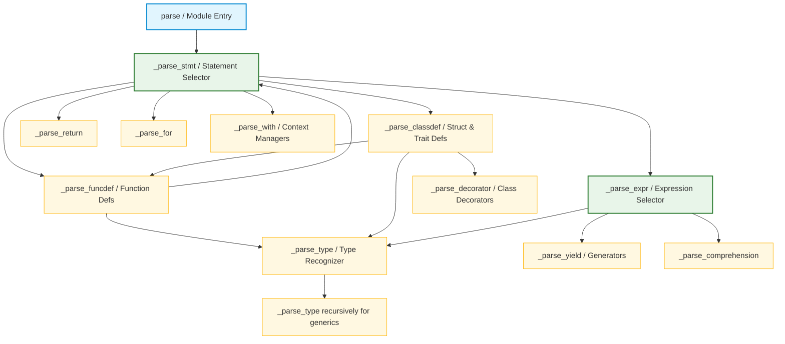
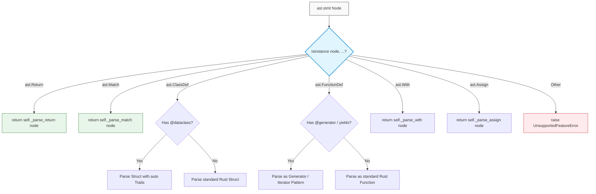

# Module 2: Introduction to Syntax Analysis

> A technical study guide grounded in the **py2rust** compiler implementation  
> _Compiler Design — Academic Reference Document_

---

## Table of Contents

1. [Executive Summary](#executive-summary)
2. [Role of the Syntax Analyser](#1-role-of-the-syntax-analyser)
   - [Syntax Error Handling in py2rust](#syntax-error-handling-in-py2rust)
3. [Review of Context-Free Grammars](#2-review-of-context-free-grammars)
   - [Derivations and Parse Trees](#derivations-and-parse-trees)
   - [Eliminating Ambiguity](#eliminating-ambiguity)
4. [Basic Parsing Approaches](#3-basic-parsing-approaches)
   - [Eliminating Left Recursion](#eliminating-left-recursion)
   - [Left Factoring](#left-factoring)
5. [Top-Down Parsing](#4-top-down-parsing)
   - [Recursive Descent Parsing](#recursive-descent-parsing)
   - [Predictive Parsing](#predictive-parsing)
   - [LL(1) Grammars](#ll1-grammars)
6. [py2rust: Where Syntax Analysis Lives](#py2rust-where-syntax-analysis-lives)
7. [Summary Table](#summary-table)
8. [Glossary](#glossary)

---

## Executive Summary

Syntax analysis (parsing) is the second phase of a compiler. It reads the flat token stream produced by the lexer and builds a tree structure that represents the grammatical relationships between tokens.

In **py2rust**, the two-layer frontend architecture makes this study particularly clear:

- **Layer 1 — CPython's parser:** Converts raw Python source text into a rich `ast.Module` tree, handling all of Python's grammar, precedence, and associativity rules.
- **Layer 2 — py2rust `Parser`** (`py2rust/frontend/parser.py`): A hand-written **recursive descent translator** that walks CPython's AST and builds py2rust's own typed AST (`py2rust/frontend/ast_nodes.py`).

Layer 2 is a textbook **recursive descent parser** written over an already-parsed tree. Every method `_parse_X` corresponds directly to a non-terminal in py2rust's internal grammar for recognising which Python constructs it supports.

---

## 1. Role of the Syntax Analyser

### Theory

The syntax analyser (parser) has three jobs:

1. **Verify** that the token sequence conforms to the grammar.
2. **Report** useful errors when it does not.
3. **Produce** a structure (parse tree or AST) consumed by later phases.

The parser is positioned between the lexer (tokeniser) and the semantic analyser:

```mermaid
flowchart LR
    src[Source Text] -->|Lexical Scanning| tokens(Token Stream)
    tokens -->|Syntax Analysis: ast.parse| cpy_ast(CPython AST)
    cpy_ast -->|Translation: frontend/parser.py| custom_ast(py2rust AST)
    custom_ast -->|Semantic Analysis: middleend/| annotated_ast(Annotated AST / IR)

    style src fill:#fafafa,stroke:#333;
    style tokens fill:#fff3e0,stroke:#f57c00;
    style cpy_ast fill:#e1f5fe,stroke:#0288d1;
    style custom_ast fill:#e8f5e9,stroke:#2e7d32,stroke-width:2px;
    style annotated_ast fill:#ede7f6,stroke:#5e35b1;
```



### Syntax Error Handling in py2rust

Error handling is a first-class concern. Real parsers must:
- Detect the error at the right point
- Emit a message that helps the user fix the issue
- **Recover** and continue parsing (to find more errors)

#### py2rust Error Hierarchy

```python
# py2rust/utils/errors.py
class CompilerError(Exception):
    message: str
    filename: str
    line: int
    column: int
    suggestion: Optional[str]      # actionable hint for the user
    source_lines: list             # the raw source, for caret display

class ParseError(CompilerError): pass
class UnsupportedFeatureError(CompilerError): pass
class SemanticError(CompilerError): pass
class Py2RustTypeError(CompilerError): pass
```

The `__str__` method of `CompilerError` formats errors with a **caret pointer** — the same style used by GCC and Rust's own compiler:

```python
# utils/errors.py
def __str__(self) -> str:
    loc = f"{self.filename}:{self.line}:{self.column}"
    parts = [f"{self.__class__.__name__}: {loc}: {self.message}"]
    if self.source_lines and 0 < self.line <= len(self.source_lines):
        line_text = self.source_lines[self.line - 1]
        parts.append(f"  | {line_text}")
        if self.column > 0:
            parts.append(f"  | {' ' * (self.column - 1)}^")
    if self.suggestion:
        parts.append(f"  hint: {self.suggestion}")
    return "\n".join(parts)
```

**Sample output for a missing type annotation:**
```
UnsupportedFeatureError: example.py:3:5: Parameter 'x' is missing a type annotation
  | def add(x, y: int) -> int:
  |     ^
  hint: Add a type hint like: def f(x: int) -> int:
```

#### Error Recovery Strategies (Theory)

| Strategy | Description | Used in py2rust? |
|----------|-------------|-----------------|
| **Panic mode** | Skip tokens until a synchronising token (`;`, `}`) | Partially — `_parse_stmt` re-raises |
| **Phrase-level** | Replace an illegal token with a legal one | Via `suggestion` field |
| **Error productions** | Add error rules to the grammar | No — py2rust relies on CPython's errors first |
| **Global correction** | Find the minimum edit to make input valid | No — too expensive |

py2rust favours **early error**: if a construct is not supported, it raises `UnsupportedFeatureError` immediately with a helpful `suggestion`, rather than attempting recovery.

```python
# parser.py:205-243 (_parse_funcdef)
if arg.annotation is None:
    raise self._err(
        f"Parameter '{arg.arg}' is missing a type annotation",
        arg,
        UnsupportedFeatureError,
        suggestion="Add a type hint like: def f(x: int) -> int:",
    )
```

---

## 2. Review of Context-Free Grammars

### Theory

A **Context-Free Grammar (CFG)** is a 4-tuple `G = (V, T, P, S)`:

| Component | Meaning |
|-----------|---------|
| `V` | Set of **non-terminals** (grammar variables) |
| `T` | Set of **terminals** (tokens) |
| `P` | Set of **productions** `A → α` where `A ∈ V`, `α ∈ (V ∪ T)*` |
| `S` | **Start symbol** `S ∈ V` |

**Example CFG for arithmetic expressions:**
```
E → E + T  |  E - T  |  T
T → T * F  |  T / F  |  F
F → ( E )  |  id     |  num
```

### Derivations and Parse Trees

A **derivation** replaces one non-terminal at a time using a production rule. A **parse tree** captures the full derivation as a tree:

```
Input: 3 + 4 * 2

Parse Tree (using the grammar above):
            E
           /|\
          E + T
          |   |\ 
          T   T * F
          |   |   |
          F   F   2
          |   |
          3   4
```

- The **root** is the start symbol `E`
- **Interior nodes** are non-terminals
- **Leaves** are terminals (tokens)
- The parse tree encodes that `4 * 2` is computed before `3 + ...` because `*` is in a lower production (closer to leaves → higher precedence)

#### py2rust's Parse Tree: `ast_nodes.py`

py2rust's typed AST in `ast_nodes.py` represents exactly this tree structure. Each leaf class corresponds to a terminal, each composite class to a non-terminal:

```python
# py2rust/frontend/ast_nodes.py (condensed)

# Terminals (leaves)
@dataclass class IntLiteral:  value: int;  line: int; col: int
@dataclass class StrLiteral:  value: str;  line: int; col: int
@dataclass class BoolLiteral: value: bool; line: int; col: int
@dataclass class Name:        name: str;   line: int; col: int

# Non-terminals (interior nodes)
@dataclass class BinOp:
    op: str        # "+", "-", "*", "/"
    left: object   # E.left  — another AST node (subtree)
    right: object  # E.right — another AST node (subtree)
    line: int; col: int

@dataclass class FunctionDef:
    name: str
    params: tuple       # list of Param nodes
    return_type: object # type annotation
    body: tuple         # list of statement nodes
```

`BinOp(op="+", left=IntLiteral(3), right=BinOp(op="*", left=IntLiteral(4), right=IntLiteral(2)))` is the direct encoding of the parse tree for `3 + 4 * 2`.

### Eliminating Ambiguity

A grammar is **ambiguous** if a string has more than one parse tree (i.e., more than one leftmost or rightmost derivation).

#### Classic Ambiguity: Arithmetic

```
E → E + E | E * E | id    # AMBIGUOUS
```

`id + id * id` has two trees: `(id + id) * id` and `id + (id * id)`. The standard fix: introduce **separate non-terminals per precedence level**:

```
E → E + T | T             # + is lowest precedence
T → T * F | F             # * is higher
F → id                    # id is highest
```

Now only one parse tree exists for any expression.

#### Python Grammar's Approach

Python's grammar (in CPython's `Grammar/python.gram`) eliminates ambiguity through grammar stratification — separate rules for `disjunction`, `conjunction`, `comparison`, `sum`, `term`, `factor`, `power`, etc.

When py2rust calls `ast.parse(source)`, it receives an **unambiguous AST** — all ambiguity was resolved during CPython's parsing phase. The nesting depth of `BinOp` nodes encodes precedence; py2rust reads it faithfully:

```python
# parser.py:833-845
if isinstance(node, ast.BinOp):
    op    = _BINOP_MAP.get(type(node.op))
    left  = self._parse_expr(node.left)   # deeper = higher precedence
    right = self._parse_expr(node.right)
    return BinOp(op=op, left=left, right=right, ...)
```

#### Avoiding Ambiguity in py2rust's Own Grammar

py2rust enforces determinism in its own type-annotation grammar through explicit structural checks:

```python
# parser.py:416-445
if node.value.id in ("dict", "Dict"):
    if isinstance(node.slice, ast.Tuple):     # dict[K, V] — two args
        key_type   = self._parse_type(node.slice.elts[0])
        value_type = self._parse_type(node.slice.elts[1])
        return DictType(...)
    raise self._err("dict type requires two type arguments", ...)

if node.value.id == "Optional":               # Optional[T] — one arg
    inner = self._parse_type(node.slice)
    return OptionalType(inner_type=inner)
```

Each branch handles exactly one syntactic form — no ambiguity.

---

## 3. Basic Parsing Approaches

### Eliminating Left Recursion

A grammar has **left recursion** if a non-terminal can derive a string starting with itself:
```
A → A α | β      # Direct left recursion
```

Left recursion causes **infinite loops** in top-down (recursive descent) parsers because the parser would call `A()` → calls `A()` → ... forever.

#### Elimination Algorithm

Replace `A → A α | β` with:
```
A  → β A'
A' → α A' | ε
```

**Example — eliminating left recursion from arithmetic:**
```
Before:                    After:
E → E + T | T     →   E  → T E'
                        E' → + T E' | ε
T → T * F | F     →   T  → F T'
                        T' → * F T' | ε
F → ( E ) | id    →   (unchanged — no left recursion)
```

#### py2rust Connection

py2rust itself has no left-recursive grammar to eliminate because it translates CPython's AST (not raw tokens). However, CPython's grammar was carefully designed without left recursion so that its `pegen` parser could process it top-down. The elimination of left recursion is baked into Python's grammar design.

For example, Python's `expr_stmt` production handles chained attribute access (`a.b.c`) which *looks* like left recursion but is expressed in the grammar using the Kleiner-star of attribute suffixes rather than `AttributeExpr → AttributeExpr . id`.

In py2rust's `_get_attr_parts`, this chain is recovered by recursive descent over the already-flattened `ast.Attribute` nesting:

```python
# parser.py:141-149
def _get_attr_parts(self, attr_node):
    """Recursively extract a.b.c chain — right-to-left in the AST."""
    if isinstance(attr_node, ast.Name):
        return [attr_node.id]                       # base case: terminal
    elif isinstance(attr_node, ast.Attribute):
        parts = self._get_attr_parts(attr_node.value)  # recurse left
        if parts:
            return parts + [attr_node.attr]         # append right
    return None
```

This pattern is structurally equivalent to the right-recursive grammar `AttrChain → id | AttrChain . id`, which was left-recursion-eliminated into a right-recursive form.

### Left Factoring

**Left factoring** is required when two or more productions for the same non-terminal start with the same string, causing a top-down parser to be unable to choose between them on a single lookahead token.

```
A → α β₁ | α β₂    # Parser sees α — which production to use?
```

**Fix — factor out the common prefix:**
```
A  → α A'
A' → β₁ | β₂
```

#### py2rust Connection — Type Parsing

The `_parse_type` method faces exactly this problem. Multiple type forms start with `ast.Subscript`:
```
type → list[T]  |  dict[K,V]  |  tuple[T...]  |  Optional[T]  |  Union[T,...]  |  set[T]
```
All of these are `ast.Subscript` nodes — same "prefix." py2rust left-factors by examining the `value.id` next:

```python
# parser.py:411-446
elif isinstance(node, ast.Subscript):
    # ↑ common prefix "it's a subscript" → now factor by inner name
    if isinstance(node.value, ast.Name) and node.value.id in ("list", "List"):
        ...  # list path: β₁
    if isinstance(node.value, ast.Name) and node.value.id in ("dict", "Dict"):
        ...  # dict path: β₂
    if isinstance(node.value, ast.Name) and node.value.id in ("Optional",):
        ...  # Optional path: β₃
    if isinstance(node.value, ast.Name) and node.value.id in ("Union",):
        ...  # Union path: β₄
```

This is mechanically identical to left factoring: the `isinstance(node, ast.Subscript)` check is the common prefix `α`; each inner `node.value.id` check is one of the `β` alternatives.

Similarly, the `|` (pipe) binary-or syntax for union types needs to be distinguished from arithmetic `|`:

```python
# parser.py:447-457
elif isinstance(node, ast.BinOp) and isinstance(node.op, ast.BitOr):
    # Python 3.10+ "int | str" union syntax — same token "|", different grammar rule
    left  = self._parse_type(node.left)
    right = self._parse_type(node.right)
    # Flatten nested unions
    variants = []
    for t in (left, right):
        if isinstance(t, UnionType):
            variants.extend(t.variants)
        else:
            variants.append(t)
    return UnionType(variants=tuple(variants))
```

---

## 4. Top-Down Parsing

Top-down parsing builds the parse tree **from root to leaves**, expanding non-terminals using productions, guided by the input tokens.

### Recursive Descent Parsing

**Recursive descent** is the most intuitive top-down strategy: write one procedure per non-terminal, where each procedure tries to match its production(s) against the input.

#### py2rust Recursive Descent Call Graph



```
procedure E():
    T()
    E_prime()

procedure E_prime():
    if lookahead == '+':
        match('+')
        T()
        E_prime()
    else:
        # ε production — do nothing

procedure T():
    F()
    T_prime()
    ...
```

This is exactly what py2rust's `Parser` class is — **one method per syntactic category**:

```python
# parser.py — Recursive Descent method inventory
class Parser:
    def parse(self)             # → Module (start symbol)
    def _parse_funcdef(...)     # → FunctionDef
    def _parse_classdef(...)    # → ClassDef
    def _parse_class_body(...)  # → list[stmt]
    def _parse_type(...)        # → TypeAnnotation
    def _parse_stmt(...)        # → Statement
    def _parse_for(...)         # → ForRange | ForIter
    def _parse_expr(...)        # → Expression
    def _parse_lambda(...)      # → LambdaExpr
    def _parse_comprehension(.) # → Comprehension
    def _parse_match(...)       # → MatchStmt
    def _parse_pattern(...)     # → MatchPattern
    def _parse_with(...)        # → WithStmt
    def _parse_assert(...)      # → AssertStmt
    def _parse_global(...)      # → GlobalStmt
    def _parse_import(...)      # → Import
    def _parse_import_from(...) # → ImportFrom
```

Each method reads its corresponding AST node and produces py2rust's typed AST equivalent. Mutual recursion is present:

```
parse → _parse_funcdef → _parse_stmts → _parse_stmt → _parse_expr → _parse_expr (recursive)
                                                      → _parse_match → _parse_pattern
      → _parse_classdef → _parse_class_body → _parse_funcdef (recursive!)
```

This forms a **call tree that mirrors the parse tree** — the defining property of recursive descent.

#### Concrete Example — Parsing a `for` loop

The production for a for statement:
```
ForStmt → 'for' target 'in' iterable ':' body
        | 'for' id 'in' 'range' '(' ... ')' ':' body
```

py2rust's `_parse_for` method mirrors this:
```python
# parser.py:754-803
def _parse_for(self, node: ast.For):
    # Detect `for x in range(...)` (ForRange) vs `for x in iterable:` (ForIter)
    if (isinstance(node.iter, ast.Call) and
        isinstance(node.iter.func, ast.Name) and
        node.iter.func.id == "range"):
        # → Production: ForStmt → for id in range(...): body
        ...
        return ForRange(...)
    else:
        # → Production: ForStmt → for target in iterable: body
        target = ...
        iterable = self._parse_expr(node.iter)   # recurse into expression
        body     = self._parse_stmts(node.body)  # recurse into statements
        return ForIter(...)
```

The lookahead here is the **type of `node.iter`**: if it's a `range()` call, take one production; otherwise take another.

#### Concrete Example — Parsing a Context Manager (`with` / `async with`)

The production for a context manager statement:
```
WithStmt → 'with' with_item (',' with_item)* ':' body
         | 'async' 'with' with_item (',' with_item)* ':' body
```

In `py2rust`, the hand-written parser maps both `ast.With` and `ast.AsyncWith` AST nodes to our internal `WithStmt` AST node via recursive dispatch on sub-expressions:
```python
# parser.py:1328-1348
def _parse_with(self, node: Union[ast.With, ast.AsyncWith]) -> WithStmt:
    is_async = isinstance(node, ast.AsyncWith)
    items = []
    for item in node.items:
        vars_ = self._parse_expr(item.optional_vars) if item.optional_vars else None
        items.append(
            WithItem(
                context_expr=self._parse_expr(item.context_expr), # recurse context expression
                optional_vars=vars_,                            # recurse optional binding
                line=item.context_expr.lineno,
                col=item.context_expr.col_offset + 1,
            )
        )
    body = tuple(self._parse_stmts(node.body))                  # recurse block statements
    return WithStmt(
        items=tuple(items),
        body=body,
        is_async=is_async,
        line=node.lineno,
        col=node.col_offset + 1,
    )
```

#### Concrete Example — Early Rejection of Ternary Expressions (`ast.IfExp`)

To enforce readable and structured control flow, the transpiler rejects ternary conditional expressions. When the expression-dispatch routine `_parse_expr` encounters an `ast.IfExp` node, it immediately raises an error without further tree traversal, preventing subsequent synthesis phases:
```python
# parser.py:1117-1120
if isinstance(node, ast.IfExp):
    raise self._err(
        "Ternary expressions are not supported", node, UnsupportedFeatureError
    )
```
This serves as a classical **early syntax-directed translation reject state**, where syntactic checks halt processing before semantic verification can begin.

### Predictive Parsing


**Predictive parsing** is recursive descent without backtracking. The parser looks at the next input token (the **lookahead**) and **deterministically** chooses a production.

This is only possible when the grammar is **LL(1)** — no two productions for the same non-terminal start with the same terminal.

The parser is driven by a **predictive parsing table** `M[A, a]` where:
- `A` is the current non-terminal to expand
- `a` is the current lookahead token
- `M[A, a]` gives the production to use, or ERROR

#### LL(1) Predictive Parsing Decision Tree



#### py2rust's `_parse_stmt` — A Predictive Dispatch Table

```python
# parser.py:472-750 (condensed)
def _parse_stmt(self, node):
    if isinstance(node, ast.Return):      return self._parse_return(node)  # lookahead: 'return'
    if isinstance(node, ast.Match):       return self._parse_match(node)   # lookahead: 'match'
    if isinstance(node, ast.AnnAssign):   ...                               # lookahead: annotated assign
    if isinstance(node, ast.Assign):      ...                               # lookahead: '='
    if isinstance(node, ast.AugAssign):   ...                               # lookahead: '+=', '-=', ...
    if isinstance(node, ast.ClassDef):    return self._parse_classdef(node) # lookahead: 'class'
    if isinstance(node, ast.If):          ...                               # lookahead: 'if'
    if isinstance(node, ast.While):       ...                               # lookahead: 'while'
    if isinstance(node, ast.For):         return self._parse_for(node)      # lookahead: 'for'
    if isinstance(node, ast.Try):         ...                               # lookahead: 'try'
    if isinstance(node, ast.With):        return self._parse_with(node)     # lookahead: 'with'
    if isinstance(node, ast.Assert):      return self._parse_assert(node)   # lookahead: 'assert'
    if isinstance(node, ast.Global):      return self._parse_global(node)   # lookahead: 'global'
    if isinstance(node, ast.Nonlocal):    return self._parse_nonlocal(node) # lookahead: 'nonlocal'
    if isinstance(node, ast.Expr):        ...                               # lookahead: expression
    if isinstance(node, ast.Pass):        return PassStmt(...)              # lookahead: 'pass'
    if isinstance(node, ast.Break):       return BreakStmt(...)             # lookahead: 'break'
    if isinstance(node, ast.Continue):    return ContinueStmt(...)          # lookahead: 'continue'
    if isinstance(node, ast.Delete):      ...                               # lookahead: 'del'
    if isinstance(node, ast.Import):      ...                               # lookahead: 'import'
```

Here, the **AST node type is the lookahead token**. Each `if isinstance(node, ast.X)` branch is a row in the predictive parsing table: `M[Stmt, X] = production_for_X`.

Since CPython's already-parsed AST guarantees that each node type is unambiguous, every lookup is **deterministic** — exactly LL(1) behaviour.

#### Compare: Theory vs py2rust

| Theory (LL(1)) | py2rust |
|----------------|--------|
| Predictive table `M[A, a]` | `if isinstance(node, ast.X)` chain in `_parse_stmt` |
| Lookahead token `a` | `type(node)` — the AST node class |
| Non-terminal `A` | The current `_parse_X` method |
| Production chosen | The block of code that builds and returns the py2rust AST node |
| ERROR entry | `raise UnsupportedFeatureError(...)` |

### LL(1) Grammars

A grammar is **LL(1)** if its predictive parsing table has **no conflicts** — every cell `M[A, a]` has at most one production.

#### FIRST and FOLLOW Sets

Two sets are needed to construct the LL(1) table:

**FIRST(α):** The set of terminals that can begin strings derived from `α`.
- `FIRST(ε) = {ε}`
- `FIRST(a β) = {a}` for terminal `a`
- `FIRST(A β) = FIRST(A)` if `A` cannot derive `ε`, else `FIRST(A) ∪ FIRST(β)`

**FOLLOW(A):** The set of terminals that can immediately follow `A` in some sentential form.
- `FOLLOW(S) = {$}` (start symbol is followed by end-of-input)
- If `B → α A β`: add `FIRST(β) - {ε}` to `FOLLOW(A)`
- If `B → α A` or `B → α A β` where `ε ∈ FIRST(β)`: add `FOLLOW(B)` to `FOLLOW(A)`

#### LL(1) Table Construction

For each production `A → α`:
- For each terminal `a ∈ FIRST(α)`: add `A → α` to `M[A, a]`
- If `ε ∈ FIRST(α)`: for each `b ∈ FOLLOW(A)`, add `A → α` to `M[A, b]`

If any cell has two entries, the grammar is **not LL(1)**.

#### Example — Type Grammar (simplified py2rust)

```
Type → 'int' | 'float' | 'bool' | 'str'
     | 'list' '[' Type ']'
     | 'dict' '[' Type ',' Type ']'
     | 'Optional' '[' Type ']'
     | ClassName
```

**FIRST sets:**
```
FIRST(Type) = { 'int', 'float', 'bool', 'str', 'list', 'dict', 'Optional', id }
```

Each alternative starts with a **distinct terminal** — so the table has no conflicts. This grammar is LL(1), and `_parse_type` parses it without backtracking.

#### What Makes a Grammar Non-LL(1)?

| Violation | Example | Fix |
|-----------|---------|-----|
| Left recursion | `E → E + T` | Eliminate left recursion |
| Common prefix | `A → α β₁ \| α β₂` | Left factor |
| Ambiguity | `A → β \| β` | Rewrite grammar |

Python's full grammar is not LL(1) globally (it requires PEG/LR for some constructs), but the **subset that py2rust supports** is designed to be handled predictively by `isinstance` dispatch on unambiguous AST node types.

---

## py2rust: Where Syntax Analysis Lives

```
py2rust/
├── frontend/
│   ├── parser.py          ← Recursive descent translator (the syntax analyser)
│   │   ├── Parser.parse()           # Start symbol dispatch
│   │   ├── _parse_funcdef()         # Non-terminal: FunctionDefinition
│   │   ├── _parse_classdef()        # Non-terminal: ClassDefinition
│   │   ├── _parse_stmt()            # Non-terminal: Statement (predictive table)
│   │   ├── _parse_type()            # Non-terminal: TypeAnnotation (left-factored)
│   │   ├── _parse_expr()            # Non-terminal: Expression
│   │   └── _err()                   # Unified error reporting with caret display
│   │
│   └── ast_nodes.py       ← The parse tree node types (non-terminals + terminals)
│       ├── IntLiteral, StrLiteral, ...   # Terminal nodes (leaves)
│       ├── BinOp, UnaryOp, ...           # Expression non-terminal nodes
│       ├── FunctionDef, ClassDef, ...    # Declaration non-terminal nodes
│       └── IfStmt, WhileStmt, ForRange,  # Statement non-terminal nodes
│
└── utils/
    └── errors.py          ← Error infrastructure (ParseError + UnsupportedFeatureError)
```

### The Full Parsing Flow

```
Python source string
       │
       │  ast.parse(source)   ← CPython's LALR(1) parser (Layer 1)
       ▼
ast.Module (CPython AST)
       │
       │  Parser.parse()      ← py2rust recursive descent (Layer 2)
       ▼
Module(                       ← py2rust typed AST
  functions=[FunctionDef(...), ...],
  classes=[ClassDef(...), ...],
  statements=[VarDecl(...), IfStmt(...), ...],
  imports=[Import(...), ...],
)
```

Each `_parse_X()` call corresponds to expanding a non-terminal in py2rust's grammar. Errors are raised immediately at the point of mismatch with a user-facing message and source location.

---

## Summary Table

| Concept | Theory | py2rust Implementation |
|---------|--------|----------------------|
| **Role of syntax analyser** | Verify structure, produce AST | `Parser` class in `parser.py` |
| **Error detection** | Invalid token sequence | `isinstance` checks + `_err()` helper |
| **Error reporting** | User-facing messages with location | `CompilerError.__str__` with caret |
| **Error hints** | Phrase-level recovery suggestions | `suggestion=` parameter in `_err()` |
| **CFG non-terminals** | Grammar variables `A, B, ...` | `_parse_funcdef`, `_parse_stmt`, etc. |
| **Parse tree nodes** | Interior nodes with children | `BinOp`, `FunctionDef`, `IfStmt` in `ast_nodes.py` |
| **Leaves (terminals)** | Token nodes | `IntLiteral`, `Name`, `BoolLiteral` in `ast_nodes.py` |
| **Ambiguity elimination** | Stratified grammar for precedence | Baked into CPython's grammar; py2rust reads unambiguous tree |
| **Left recursion** | `A → A α` causes infinite loop; eliminated to right-recursive | Python grammar avoids it; `_get_attr_parts` handles chain |
| **Left factoring** | Factor common prefix `A → α β₁ \| α β₂` | `_parse_type`: common `ast.Subscript`, then factor by `node.value.id` |
| **Recursive descent** | One procedure per non-terminal | Each `_parse_X` method |
| **Predictive parsing** | Deterministic choice via lookahead | `isinstance(node, ast.X)` dispatch in `_parse_stmt` |
| **LL(1) table** | `M[A, a]` chosen by FIRST/FOLLOW | Implicit in `isinstance` chain; each type maps to one branch |
| **FIRST set** | Terminals that can start `A` | AST node types that trigger each `_parse_stmt` branch |
| **FOLLOW set** | Terminals after `A` | Used implicitly for `ε`-production decisions |

---

## Glossary

| Term | Definition |
|------|------------|
| **Syntax Analyser** | Compiler phase that reads tokens and builds a parse tree |
| **CFG** | Context-Free Grammar — `G = (V, T, P, S)` |
| **Derivation** | Sequence of substitutions from start symbol to a string of terminals |
| **Parse Tree** | Tree encoding a derivation; root = start symbol, leaves = terminals |
| **Ambiguous Grammar** | Grammar where a string has two or more parse trees |
| **Left Recursion** | `A → A α`; causes infinite loop in recursive descent |
| **Left Factoring** | Factoring `A → α β₁ | α β₂` into `A → α A'`, `A' → β₁ | β₂` |
| **Recursive Descent** | Top-down parser with one procedure per non-terminal |
| **Predictive Parser** | Recursive descent without backtracking; uses lookahead |
| **LL(1)** | Left-to-right, Leftmost derivation, 1 lookahead token — condition for predictive parsing |
| **FIRST(α)** | Set of terminals that can begin strings derivable from `α` |
| **FOLLOW(A)** | Set of terminals that can appear immediately after non-terminal `A` |
| **Parsing Table M[A,a]** | Gives the production to use for non-terminal `A` with lookahead `a` |
| **Lookahead** | The next unread token used to make deterministic parsing decisions |
| **ParseError** | py2rust error class for invalid Python syntax passed to the parser |
| **UnsupportedFeatureError** | py2rust error class for valid Python that py2rust cannot translate |
| **`_parse_stmt`** | py2rust's predictive dispatch method — the LL(1) table in code |
| **`_parse_type`** | py2rust's left-factored type-annotation parser |
| **`_get_attr_parts`** | py2rust's recursive chain collector — equivalent to right-recursive grammar |
