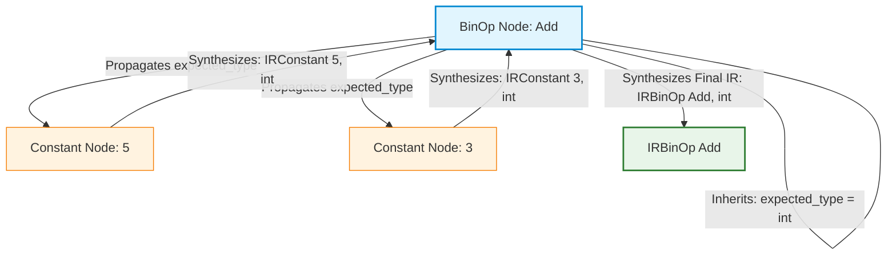
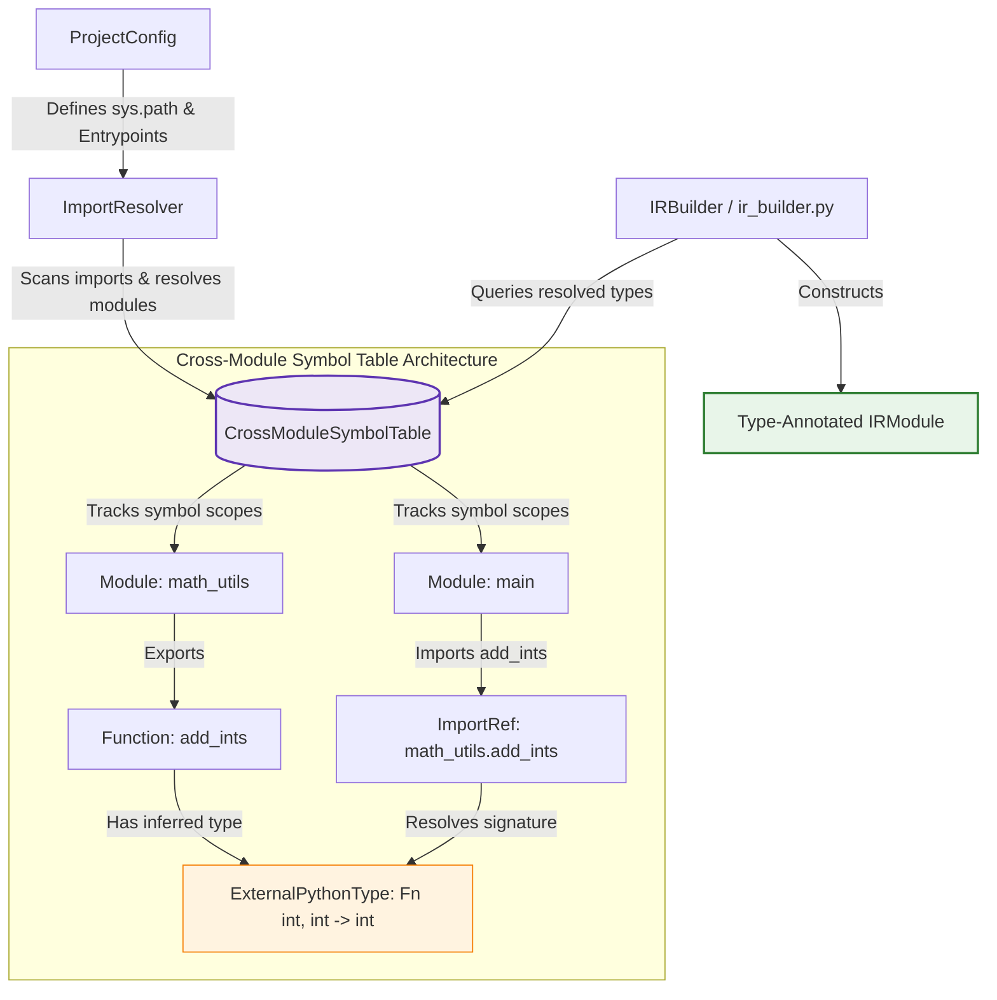

# Module 4: Syntax-Directed Translation and Intermediate Code Generation

> A technical study guide grounded in the **py2rust** compiler implementation  
> _Compiler Design — Academic Reference Document_

---

## Table of Contents

1. [Executive Summary](#executive-summary)
2. [Part A: Syntax-Directed Translation (SDT)](#part-a-syntax-directed-translation)
   - [Syntax-Directed Definitions (SDD)](#1-syntax-directed-definitions)
   - [S-attributed vs L-attributed Definitions](#2-s-attributed-vs-l-attributed-definitions)
   - [Evaluation Order and SDD Patterns](#3-evaluation-order)
3. [Part B: Run-time Environments](#part-b-run-time-environments)
   - [Storage Organization](#4-storage-organization)
   - [Storage-Allocation Strategies](#5-storage-allocation-strategies)
4. [Part C: Intermediate Code Generation (ICG)](#part-c-intermediate-code-generation)
   - [Intermediate Languages and Graphical Representations](#6-intermediate-languages)
   - [Alternative Representations (TAC, Quadruples, Triples)](#7-alternative-representations)
   - [Syntax-Directed Validation and Validation Caching](#74-syntax-directed-validation-equivalency-verification-and-validation-caching)
5. [py2rust: Connecting Theory to Practice](#py2rust-connecting-theory-to-practice)
6. [Summary Table](#summary-table)

---

## Executive Summary

Module 4 focuses on the transition from a symbolic structure (AST) to a computation structure (Intermediate Representation). It defines *how* the meaning of a program is captured during traversal and *where* that data lives during execution.

In **py2rust**, this module is embodied by the `IRBuilder` (`py2rust/middleend/ir_builder.py`) and the definition of the IR itself (`py2rust/ir/ir_nodes.py`). Unlike traditional compilers that emit Assembly or Bytecode, `py2rust` emits high-level Rust, so its "Intermediate Code" is a structured, type-enriched tree.

---

## Part A: Syntax-Directed Translation (SDT)

### 1. Syntax-Directed Definitions (SDD)

An **SDD** is a context-free grammar where each grammar symbol has a set of **attributes**, and each production has a set of **semantic rules**.

- **Synthesized Attributes:** Computed from the attributes of the node's children.
- **Inherited Attributes:** Computed from the attributes of the node's parent and/or siblings.

**py2rust analogue — `IRBuilder._build_expr`:**
When `IRBuilder` visits an expression, it "synthesizes" an IR node.

```python
# py2rust/middleend/ir_builder.py
def _build_expr(self, expr, expected_type=None):
    # 'expr' is the AST node (input)
    # 'expected_type' is an INHERITED attribute (passed down from parent)
    # The return value is the IR node (SYNTHESIZED attribute)
    return self._build_expr_internal(expr, expected_type)
```

#### SDT Attribute Evaluation Tree for `5 + 3` with `expected_type=int`



---

### 2. S-attributed vs L-attributed Definitions

#### 2.1 S-attributed Definitions
An SDD is **S-attributed** if all its attributes are **synthesized**. These are typical for bottom-up parsing or single-pass recursive traversal.

**Example in py2rust:** Binary operations.
```python
# Conceptual SDD Rule:
# E -> E1 + E2 { E.ir = IRBinOp(E1.ir, "+", E2.ir) }
```
The IR node for the addition is purely a function of its children's IR nodes.

#### 2.2 L-attributed Definitions
An SDD is **L-attributed** if its attributes are either synthesized OR inherited with a constraint: inherited attributes of a child must depend only on attributes of the parent and *left* siblings.

**Example in py2rust:** Function parameter checking.
When building a function call, the `expected_type` for each argument is inherited from the function signature (parent context) and passed down to each argument expression visitor.

---

### 3. Evaluation Order

Traditional compilers often use a "Semantic Stack" during a bottom-up (LR) parse to evaluate S-attributed definitions. **py2rust**, being a recursive-descent IR builder, uses the **Call Stack** of the compiler itself.

- **Post-order Traversal:** Children are visited first, then the parent node is built (Synthesized).
- **Pre-order Traversal:** Context (like type constraints) is passed down before children are visited (Inherited).

---

## Part B: Run-time Environments

### 4. Storage Organization

During execution, the target program must organize memory. Python and Rust have starkly different philosophies:

| Feature | Python (Source) | Rust (Target) |
|---------|-----------------|---------------|
| **Memory Management** | Dynamic, Garbage Collected | Static, Ownership/RAII |
| **Integers** | Arbitrary precision (heap) | Fixed-size `i32`/`i64` (stack) |
| **Strings** | Immutable (heap) | `String` (heap) or `&str` (stack/ref) |
| **Collections** | Heterogeneous, Dynamic | Homogeneous, Type-safe |

**py2rust's mapping strategy:**
The compiler must select a storage layout in Rust that satisfies Python's semantics while respecting Rust's safety.

```python
# py2rust/backend/rust_codegen.py:161
def _get_rust_type(self, ir_type) -> str:
    if isinstance(ir_type, IRIntType): return "i32" # Stack
    if isinstance(ir_type, IRStrType): return "String" # Heap
    # ...
```

#### Detailed Type Translation and Semantic Mapping Table

To bridge the gap between Python's dynamic runtime environment and Rust's strict static storage constraints, the synthesis phase implements a deterministic type translation map:

| Python Type | IR Node | Rust Target Type | Memory Strategy & Rationale |
|-------------|---------|------------------|-----------------------------|
| `int` | `IRIntType` | `i32` or `i64` | **Stack-allocated**: Maps to fixed-size native machine primitives for high-performance arithmetic. |
| `float` | `IRFloatType` | `f64` | **Stack-allocated**: Double-precision floating-point format matching IEEE 754 standards. |
| `str` | `IRStrType` | `String` | **Heap-allocated**: Owned dynamic string buffer, allowing safe growth and mutation. |
| `bool` | `IRBoolType` | `bool` | **Stack-allocated**: Standard single-byte binary flag. |
| `list[T]` | `IRListType` | `Vec<T>` | **Heap-allocated**: Contiguous, dynamically resizable vector. |
| `dict[K, V]` | `IRDictType` | `HashMap<K, V>` | **Heap-allocated**: Key-value hash map; automatically emits standard library imports. |
| `set[T]` | `IRSetType` | `HashSet<T>` | **Heap-allocated**: Unique element set; automatically emits standard library imports. |
| `deque[T]` | `IRDequeType` | `VecDeque<T>` | **Heap-allocated**: Double-ended queue for efficient double-ended pushes and pops. |
| `heap` (via `heapq`) | `IRHeapType` | `BinaryHeap<Reverse<T>>` | **Heap-allocated**: Uses standard `std::collections::BinaryHeap` wrapped with `std::cmp::Reverse` to emulate Python's min-heap semantics. |
| `Optional[T]` | `IROptionalType` | `Option<T>` | **Stack-allocated** (typically): Pure algebraic sum-type representation of nullability (`Some`/`None`), eliminating pointer-chasing overhead. |
| `Generator[Y, S, R]` | `IRGeneratorType` | `Box<dyn Iterator<Item = Y>>` / `XGenerator` | **Heap-allocated**: Lowered into a bespoke struct representing a generator's state machine, optionally boxed for dynamic traits. |

---

### 5. Storage-Allocation Strategies

1. **Static Allocation:** Variables with fixed memory addresses (Global variables in Rust).
2. **Stack Allocation:** Managed via activation records (Function local variables).
3. **Heap Allocation:** Dynamic memory for objects with lifetimes exceeding their creating function (Strings, Vectors).

**py2rust analogue — Variable Hoisting:**
To mimic Python's function scope in Rust's block scope, py2rust uses **pre-declaration hoisting**. This ensures storage is allocated at the start of the function, even if the variable is first assigned inside a loop.

```python
# py2rust/backend/codegen_helpers.py:286
# _collect_decls determines which variables must be stack-allocated 
# at the function entry point.
```

---

## Part C: Intermediate Code Generation (ICG)

### 6. Intermediate Languages

An **Intermediate Representation (IR)** is a simplified version of the code that facilitates optimization and translation.

#### 6.1 Graphical Representations
- **Abstract Syntax Tree (AST):** Represents the hierarchical structure of the source.
- **Directed Acyclic Graph (DAG):** Similar to AST, but common subexpressions are shared.
- **py2rust IR:** A tree-based IR that mirrors the AST but is **typed**. Every node in `ir/ir_nodes.py` carries semantic information that was not present in the original Python AST.

```python
# py2rust/ir/ir_nodes.py
class IRAssign(IRStmt):
    target: str
    value: IRExpr
    target_type: IRType  # This 'attribute' makes it an IR node, not just AST
```

#### Multi-Module Environment & Cross-Module Type Resolution Flowchart



---

### 7. Alternative Representations

While py2rust uses a tree IR, other compilers use linear IRs:

#### 7.1 Three-Address Code (TAC)
A sequence of instructions of the form `x = y op z`. TAC is much closer to machine code.

#### 7.2 Quadruples
A structure with four fields: `(op, arg1, arg2, result)`.
- `add, a, b, t1`

#### 7.3 Triples
A structure with three fields: `(op, arg1, arg2)`. The result is implicitly the index of the triple.

> [!NOTE]
> **Why py2rust uses Tree IR over TAC?**  
> For source-to-source translation (Python → Rust), a Tree IR preserves the high-level control structures (`if`, `while`, `match`) which Rust supports natively. Flattening to TAC would lose the "idiomatic" nature of the generated Rust code.

### 7.4 Syntax-Directed Validation, Equivalency Verification, and Validation Caching

Translating source code via a transpiler is an attribute-driven semantic mapping process. However, to guarantee that the synthesized Rust target is semantically equivalent to the Python source, **py2rust** introduces a syntax-directed verification pipeline equipped with SQLite-backed validation caching:

1. **Semantic Attribute Extraction (Neo Patterns)**:
   During AST-to-IR lowering, the compiler extracts synthesized semantic context:
   - `Qname`: The fully-qualified name paths of classes and methods.
   - `Qglobal_flow`: Global resource operations or external module access.
   - `Qcall`: Call sites and dynamic arguments.
   
2. **Compound Fingerprint Generation**:
   A deterministic SHA-256 validation fingerprint is generated using:
   - The original Python source code segment.
   - The compiled Rust target code segment.
   - The translation configuration options (e.g., target compilation flags, type annotation strategies).
   
   $$\text{validation\_fingerprint} = \text{SHA-256}(\text{python\_source} + \text{generated\_rust} + \text{compiler\_config})$$

3. **Validation Cache Strategy (`validations.db`)**:
   - The compiler maintains a lightweight `validations.db` database inside the app directory.
   - If a matching `validation_fingerprint` exists in the cache and has been verified or manually approved, the validation step is bypassed completely, enabling instant incremental compilation.
   - If a mismatch or cache-miss occurs, the equivalence checker executes a semantic analysis validation.

4. **Human-in-the-Loop (HITL) Triage & Manual Certification**:
   - When automated semantic validation fails (due to highly dynamic behaviors, complex loops, or lookahead anomalies), and `--review-failures` is active, compilation suspends.
   - The compiler enters the **Interactive HITL Triage Console**.
   - The developer can choose to **manually certify** that the translation is semantically correct.
   - Upon certification, an override entry is written to `validations.db` setting `is_hitl = 1`. This permanently flags the specific compilation fingerprint as valid, preventing future verification stalls.

This architectural integration guarantees compiler safety without compromising incremental build speeds.

---

## py2rust: Connecting Theory to Practice

| Theory Concept | py2rust Implementation Path | Notes |
|----------------|----------------------------|-------|
| **Syntax-Directed Definition** | `py2rust/middleend/ir_builder.py` | The logic mapping AST nodes to IR nodes via rules. |
| **Synthesized Attributes** | `_build_expr` returns (IRNode) | The result is synthesized from children. |
| **Inherited Attributes** | `expected_type` parameter | Passed down for type inference. |
| **Storage Organization** | `_get_rust_type` mapping | Mapping high-level Python types to Rust storage. |
| **Intermediate Representation** | `py2rust/ir/ir_nodes.py` | The data structures defining the IR. |
| **Graphical Code** | Tree-based IR nodes | Hierarchical representation suitable for transpilation. |
| **Environment Handling** | `py2rust/middleend/symbol_table.py` | Tracks variable bindings and storage requirements. |

---

## Summary Table

| Phase | Purpose | py2rust Implementation |
|-------|---------|------------------------|
| **Translation** | Map AST to IR | `IRBuilder` (SDT) |
| **Attribution** | Check/Incorporate types | `TypeChecker` / `TypeInferencer` |
| **Memory Planning** | Define storage types | `_get_rust_type` in `RustCodegen` |
| **IR Generation** | Produced typed tree | `ir_nodes.py` structures |
