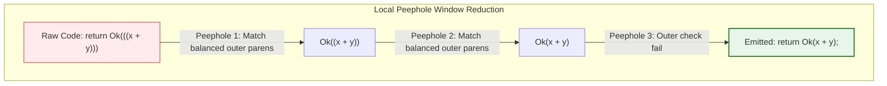
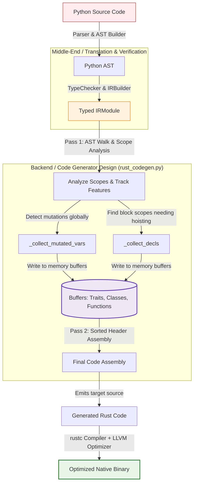
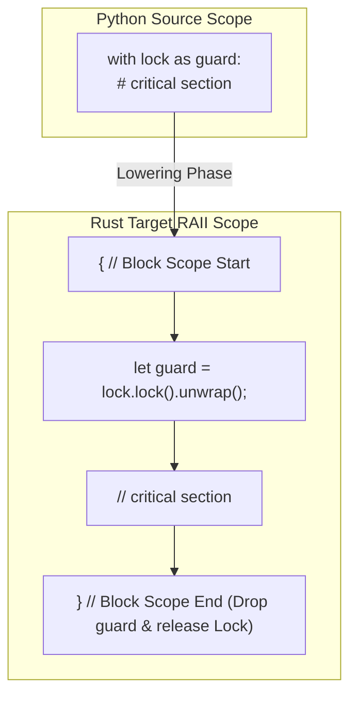
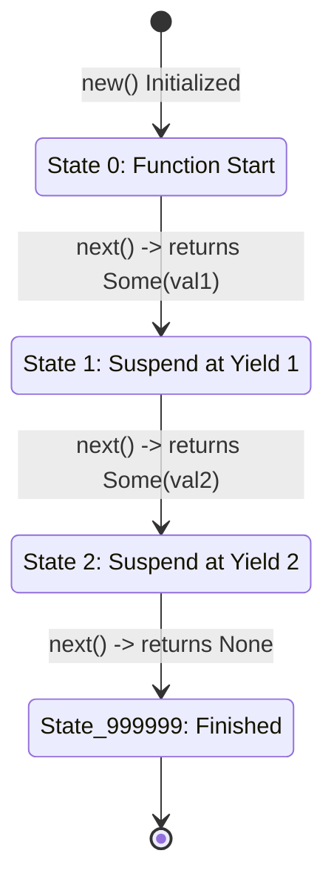

# Module 5: Code Optimization & Code Generation

> A technical study guide grounded in the **py2rust** compiler implementation  
> _Compiler Design — Academic Reference Document_

---

## Table of Contents

1. [Executive Summary](#executive-summary)
2. [Part A: Code Optimization](#part-a-code-optimization)
   - [Principal Sources of Optimization](#1-principal-sources-of-optimization)
   - [Machine-Independent Optimizations](#2-machine-independent-optimizations)
   - [Machine-Dependent Optimizations](#3-machine-dependent-optimizations)
   - [Local Optimizations](#4-local-optimizations)
   - [Global Optimizations](#5-global-optimizations)
3. [Part B: Code Generation](#part-b-code-generation)
   - [Issues in Code Generator Design](#6-issues-in-the-design-of-a-code-generator)
   - [Target Language Considerations](#7-target-language)
   - [A Simple Code Generator](#8-a-simple-code-generator)
4. [py2rust: Connecting Theory to Practice](#py2rust-connecting-theory-to-practice)
5. [Summary Table](#summary-table)
6. [Glossary](#glossary)

---

## Executive Summary

Module 5 bridges the gap between a *semantically correct* compiler and a *high-performance, deployable* one. After the frontend (parsing) and middle-end (type inference, IR building) have produced a well-typed Intermediate Representation, two final concerns dominate:

1. **Optimization** — eliminating redundant computations and restructuring code so it runs faster or uses less memory.
2. **Code Generation** — translating the IR into concrete instructions (or source text) for the target language/machine.

The **py2rust** compiler is an excellent real-world lens for these topics: it translates Python (a dynamically-typed, garbage-collected language) to Rust (a statically-typed, zero-cost-abstraction language). Every design decision in `py2rust/backend/rust_codegen.py` maps directly to one of the theory sections below.

---

## Part A: Code Optimization

### 1. Principal Sources of Optimization

Optimizations arise from exploiting **redundancy** in source programs. Compilers look for opportunities where:

- A value is computed multiple times (redundant computation)
- A computation cannot possibly affect the output (dead code)
- A computation could be moved to a cheaper point (strength reduction, loop invariant code motion)
- Constants can be folded at compile time instead of at runtime

**Four primary sources:**

| Source | Description | Example |
|--------|-------------|---------|
| **Redundant evaluation** | Same expression computed twice | `x*2 + x*2` → compute `x*2` once |
| **Dead code** | Code that can never execute | `if False: ...` → remove entirely |
| **Reachable but wasted** | Variable assigned but never read | `y = expensive(); return 0` |
| **Algebraic identities** | Mathematical laws simplify expressions | `x * 1 → x`, `x + 0 → x` |

> [!NOTE]
> In py2rust, the _compiler itself_ performs very few runtime optimizations — it relies on Rust's own compiler (`rustc`) and LLVM backend to do the heavy lifting. However, py2rust makes important **structural decisions** during IR lowering that enable `rustc`'s optimizer to succeed where a naïve translation would prevent it.

---

### 2. Machine-Independent Optimizations

These optimizations are performed on the IR and are valid regardless of the target hardware. They depend only on the **semantics of the source language**.

#### 2.1 Constant Folding

Evaluate constant expressions at compile time.

```python
# Python source
x: int = 2 + 3 * 4
```

A constant-folding pass would reduce `2 + 3 * 4` to `14` before emitting any code. py2rust does not currently implement a constant folding pass but emits the expression faithfully, relying on `rustc`/LLVM to fold.

#### 2.2 Common Subexpression Elimination (CSE)

Recognize identical subexpressions and compute them only once.

```python
a = b * c + b * c   # b * c computed twice
```

A CSE pass introduces a temporary:
```rust
let __t0 = b * c;
let a = __t0 + __t0;
```

#### 2.3 Dead Code Elimination

Remove computation whose result is never used. In the control-flow context, this also means removing branches that can never be taken.

**py2rust analogue:** After fixing the `IRSome` bug (Wave 19), the `describe_number` function no longer generated an unreachable `Ok(String::new())` below an exhaustive `if/else` — a structural decision that eliminated the `unreachable_code` warning triggered by `rustc`.

See [`rust_codegen.py:1480-1491`](../py2rust/backend/rust_codegen.py#L1480) for `IRReturn` handling.

#### 2.4 Copy Propagation

After `x = y`, replace later uses of `x` with `y` where possible, collapsing unnecessary variable chains.

#### 2.5 Strength Reduction

Replace expensive operations with cheaper equivalents.

| Expensive | Cheaper |
|-----------|---------|
| `x * 2` | `x + x` or `x << 1` |
| Floor division `a // b` | Integer division |

**py2rust analogue:** Python's `/` always produces `float`. Python's `//` is floor division. py2rust maps these using explicit strength reduction in `_gen_expr`:

```python
# py2rust/backend/rust_codegen.py (IRBinOp handling)
if op == "//":
    # Strength-reduced: use floating-point floor then cast back
    return f"({left} as f64 / {right} as f64).floor() as i32"
```

---

### 3. Machine-Dependent Optimizations

These optimizations are target-specific and depend on properties of the hardware or target runtime, such as register counts, memory hierarchy, instruction sets, and calling conventions.

#### 3.1 Register Allocation

Assign frequently used variables to fast CPU registers. This is entirely handled by LLVM when `rustc` compiles the generated Rust code.

#### 3.2 Instruction Selection

Choose the single optimal machine instruction for a high-level operation. For example, `x86` has a `LEA` (Load Effective Address) instruction that can compute `base + offset * scale` in one clock cycle.

#### 3.3 Instruction Scheduling

Reorder instructions to minimize pipeline stalls, without changing semantics. Relevant for modern out-of-order CPUs.

#### 3.4 Memory Layout Optimization

For Rust specifically, `rustc` applies layout optimizations on `struct` types (field reordering for alignment, niche optimization for enums, etc.). These are machine-dependent because they depend on the target ABI.

**py2rust analogue:** py2rust generates `#[derive(Clone, Debug)]` for all structs. When `serde_json` is detected, it also emits `#[derive(Serialize, Deserialize)]`. These derive macros influence LLVM code generation paths.

```python
# py2rust/backend/rust_codegen.py:897-900
if self._uses_serde_json:
    self._emit(f"#[derive(Clone, Debug, Serialize, Deserialize)]")
else:
    self._emit(f"#[derive(Clone, Debug)]")
```

---

### 4. Local Optimizations

A **local optimization** operates within a single **basic block** — a maximal straight-line sequence of code with no branches in or out.

#### 4.1 Basic Blocks

A basic block ends at:
- A branch instruction (conditional jump, `return`)
- A label that is the target of any branch

Within a basic block, control flow is linear, making analysis much simpler than across blocks.

#### 4.2 Peephole Optimization

Examine a small "window" (peephole) of consecutive instructions and replace with a more efficient sequence.

**Common peephole transforms:**

| Pattern | Optimized Form |
|---------|---------------|
| `MOV R1, R2; MOV R2, R1` | `MOV R1, R2` (second move is redundant) |
| `ADD R0, #0` | `NOP` (adding zero is a no-op) |
| `MUL R0, R0, 1` | `NOP` |

**py2rust analogue — `_strip_parens`:**

The `_strip_parens` method in `rust_codegen.py` is a local (peephole-like) optimization that removes redundant parentheses within a single expression:

```python
# py2rust/backend/rust_codegen.py:545-558
def _strip_parens(self, s: str) -> str:
    """Strip outer parentheses from an expression string."""
    s = s.strip()
    if s.startswith("(") and s.endswith(")"):
        count = 1
        for i in range(1, len(s) - 1):
            if s[i] == "(": count += 1
            elif s[i] == ")":
                count -= 1
                if count == 0: return s
        return s[1:-1]
    return s
```

#### Peephole Optimization: Redundant Parenthesis Reduction Window



This corrected the `return Ok((x + y));` (extra parens) bug in Wave 19, changing it to `return Ok(x + y);`.

#### 4.3 Algebraic Simplification (Local)

Within a basic block, simplify:
- `x - x → 0`
- `x * 0 → 0`  
- `x || True → True`

These are safe because there are no intervening assignments within the block.

---

### 5. Global Optimizations

**Global optimizations** operate across multiple basic blocks, using **data-flow analysis** to track information that spans branch points.

#### 5.1 Data-Flow Analysis

Data-flow analysis propagates facts about a program's data across all paths through the control-flow graph (CFG).

**Key analyses:**

| Analysis | Definition | Use |
|----------|------------|-----|
| **Reaching Definitions** | What assignments reach point P? | Used for CSE, constant propagation |
| **Live Variable Analysis** | Is variable X live (used later) at point P? | Used for dead code removal, register allocation |
| **Available Expressions** | Is expression E already computed at P? | Used for CSE across blocks |
| **Dominator Analysis** | Does block A always execute before B? | Used for loop detection |

#### 5.2 Loop Optimizations (Global)

Loops are the most critical targets since they execute many times.

**Loop Invariant Code Motion (LICM):**  
Move expressions out of loops if they produce the same result on every iteration.

```python
# Before LICM
for i in range(n):
    x = a * b   # a, b never change inside loop

# After LICM
x = a * b
for i in range(n):
    pass  # x is now used without re-computation
```

**py2rust analogue — Mutability Tracking:**  
py2rust performs a global `_collect_mutated_vars` pass over the entire function body before emitting any code. This is a form of global analysis that determines which variables need `mut` in Rust:

```python
# py2rust/backend/rust_codegen.py:228-311
def _collect_mutated_vars(stmts) -> set:
    """Recursively collect all variable names that are reassigned anywhere in the function."""
    mutated: set = set()
    # ... visits all nested scopes: if, while, for, try
    def _visit(body, in_loop=False):
        for stmt in body:
            if isinstance(stmt, IRAssign):
                mutated.add(stmt.target)
            elif isinstance(stmt, IRAugAssign):
                mutated.add(stmt.target)
            elif isinstance(stmt, IRForRange):
                for name in _get_names(stmt.target):
                    mutated.add(name)
                _visit(stmt.body, True)  # Recurse into loop body
```

This global single-pass analysis is structurally equivalent to **live variable analysis** — it identifies mutations across all CFG paths.

#### 5.3 Pre-Declaration Hoisting

Variables declared inside nested scopes (loops, `if` branches) are **hoisted** to the function's entry point. This models Python's function-scoped variables and ensures Rust's ownership rules are satisfied:

```python
# py2rust/backend/rust_codegen.py:314-386 (_collect_decls)
def _collect_decls(stmts, ...) -> tuple[dict, set]:
    decls: dict = {}
    pre_declare: set = set()

    def _recurse(body, depth=0):
        for stmt in body:
            if isinstance(stmt, IRVarDecl):
                decls[stmt.name] = stmt.type_
                if depth > 0:
                    pre_declare.add(stmt.name)  # Must be hoisted
```

Hoisting is a form of **global** transformation because it restructures variable lifetimes across block boundaries.

---

## Part B: Code Generation

### 6. Issues in the Design of a Code Generator

A code generator translates the optimized IR into the target language. Several fundamental design issues arise:

#### 6.1 Input to the Code Generator

The code generator receives an **Intermediate Representation (IR)** — a language-neutral, structured tree of operations. In py2rust, this is the `IRModule` containing:

- `IRFunction` nodes — one per Python function
- `IRClassDefinition` nodes — one per class
- `IRTraitDefinition` nodes — one per `Protocol`/ABC  
- `IREnumDef` nodes — one per enum
- Expression trees: `IRBinOp`, `IRFunctionCall`, `IRSome`, `IRSumWrap`, etc.



#### 6.2 Target Program Memory Model

The code generator must choose how source-language values map to target-language memory:

| Python Concept | Rust Mapping | Rationale |
|----------------|-------------|-----------|
| `int` | `i32` | Fixed-size signed integer (performance) |
| `float` | `f64` | IEEE 754 double precision |
| `str` | `String` | Owned heap-allocated UTF-8 string |
| `list[T]` | `Vec<T>` | Growable heap-allocated array |
| `dict[K, V]` | `HashMap<K, V>` | Hash table |
| `Optional[T]` | `Option<T>` | Null-safety enforced by type system |
| `Union[A, B]` | Custom `enum AOrBUnion` | Tagged union (ADT) |
| Python exception | `Result<T, PyError>` | Explicit error propagation |

See [`rust_codegen.py:430-493`](../py2rust/backend/rust_codegen.py#L430) for `_get_rust_type()`.

#### 6.3 Instruction Selection

For each IR node, the code generator must select appropriate target constructs. The key challenge is **correctness under semantic differences** between source and target.

**Example — Optional parameter passing:**

A Python function call `describe_number(10)` where `x: Optional[int]` must emit `describe_number(Some(10))` in Rust, not just `describe_number(10)`. The `IRSome` node encodes this wrapping:

```python
# py2rust/backend/rust_codegen.py:1870-1872
elif isinstance(expr, IRSome):
    val = self._gen_expr(expr.value)
    return f"Some({val})"   # Correct mapping for Option<T>
```

> [!IMPORTANT]
> **Wave 19 Bug:** Before the fix, this emitted `Ok(val)` instead of `Some(val)`. This caused a type mismatch error `E0308: expected Option<i32>, found Result<{integer}, _>` from Rust's compiler. The fix demonstrates that **instruction selection errors** produce mismatched types in the target program.

#### 6.4 Register and Temporaries Allocation

In a text-emitting code generator targeting a high-level language (Rust), "register allocation" is replaced by **temporary variable naming**. py2rust uses prefixed internal names to avoid clashing with user-defined variables:

```python
# Loop variables use __i_ prefix to avoid collision
# Pre-declared loop vars use __stop, __step
# Internal result variables use __result
```

Example from `rust_codegen.py` for `try/except` handling:
```rust
let __result = (|| -> Result<TryResult<i32>, PyError> {
    // ... try body
})()?;
```

#### 6.5 Evaluation Order

The order in which subexpressions are evaluated can affect:
- Side effects (important for Python)
- Temporary lifetimes
- Correctness under mutation

py2rust evaluates all function arguments left-to-right, consistent with Python's evaluation order.

#### 6.6 Condition Handling

Control-flow conditions require careful translation when the source and target semantics differ. In Python, every object is truthy/falsy. In Rust, conditions must be `bool` expressions.

```python
# Python
if x:  # Any non-zero, non-empty value is truthy
    ...
```

```rust
// Rust
if x != 0 {  // Must be explicit
    ...
}
```

py2rust's `_gen_expr` for `IRUnaryOpExpr` with `not` handles the `is_none()` special case:

```python
# rust_codegen.py:1863-1866
if isinstance(expr.operand_type, IROptionType):
    return f"{operand}.is_none()"
return f"(!({operand}))"
```

---

### 7. Target Language

#### 7.1 Properties of the Target Language

The target language profoundly constrains the code generator's decisions. Rust's key properties that drive py2rust's design:

| Property | Impact on Code Generator |
|----------|-------------------------|
| **Static typing** | Every `IRType` must map to a concrete Rust type; `_` is used only where Rust can infer |
| **Ownership + Borrowing** | Variables must be declared with correct `let` vs `let mut`; references must use `&` |
| **No null** | Python's `None` → Rust's `Option<T>`; requires `IRSome`/`IRNoneLit` nodes |
| **Explicit error handling** | All fallible functions return `Result<T, PyError>`; `?` operator propagates errors |
| **No garbage collection** | Strings/collections must be `clone()`d when transferred; py2rust currently always clones |
| **Keyword collisions** | Python identifiers like `type`, `in`, `ref`, `move` are Rust keywords; must be mangled |

The `_mangle` function handles keyword conflicts:

```python
# rust_codegen.py:153-162
_RUST_KEYWORDS = frozenset({"as","async","await","break","const","continue","crate",
    "dyn","else","enum","extern","false","fn","for","if","impl","in","let","loop",
    "match","mod","move","mut","pub","ref","return","self","Self","static","struct",
    "super","trait","true","type","union","unsafe","use","where","while"})

def _mangle(name) -> str:
    return name + "_" if name in _RUST_KEYWORDS else name
```

#### 7.2 Two-Pass Emission Strategy

py2rust uses a **two-pass** strategy to overcome a fundamental challenge: whether to emit `HashMap` imports depends on whether any `IRDictType` was encountered — but that is only known after processing all functions.

**Pass 1 (Detection):** Generate all functions, classes, and traits into **intermediate buffers**. Flag feature usage (`_uses_hashmap`, `_uses_py_error`, etc.).

**Pass 2 (Final Assembly):** Emit the final file in correct order:  
`use` imports → `PyError` enum → boilerplate → traits → classes → functions → `fn main()`

```python
# rust_codegen.py:560-855 (generate method)
# Pass 1: Build separate buffers
trait_lines, class_lines, func_lines = [], [], []
for func in ir_mod.functions:
    self._gen_function(func)
    func_lines.extend(self._lines)
    self._lines = []

# Pass 2: Assemble with correct header
final_lines = ["// Generated by py2rust"]
if self._uses_hashmap:
    imports.append("use std::collections::HashMap;")
# ...
final_lines.extend(func_lines)
```

This pattern is analogous to **two-pass assemblers** that resolve forward references.

---

### 8. A Simple Code Generator

A classic simple code generator operates using the following algorithm on basic blocks:

```
for each statement in basic block:
    1. Load operands from memory/registers into temps
    2. Emit operation
    3. Store result to target variable
    4. Update the register descriptor table
```

#### 8.1 py2rust as a Simple Tree-Walking Code Generator

py2rust implements a **recursive descent code generator** — the most direct form of a simple code generator. It walks the IR tree and emits Rust code, with no global optimization:

```python
# The central dispatch — _gen_stmt
def _gen_stmt(self, stmt) -> None:
    if isinstance(stmt, IRVarDecl):
        self._gen_var_decl(stmt)
    elif isinstance(stmt, IRAssign):
        self._gen_assign(stmt)
    elif isinstance(stmt, IRReturn):
        self._gen_return(stmt)
    elif isinstance(stmt, IRIf):
        self._gen_if(stmt)
    elif isinstance(stmt, IRWhile):
        self._gen_while(stmt)
    # ... ~20 more cases
```

```python
# The central dispatch — _gen_expr (returns string expression)
def _gen_expr(self, expr) -> str:
    if isinstance(expr, IRIntLit):
        return str(expr.value)
    elif isinstance(expr, IRStrLit):
        return f'"{expr.value}".to_string()'
    elif isinstance(expr, IRBinOp):
        left  = self._gen_expr(expr.left)
        right = self._gen_expr(expr.right)
        return f"({left} {expr.op} {right})"
    # ... ~40 more cases
```

#### 8.2 Generating a Function

The function generation illustrates how a simple code generator handles the function calling convention:

```python
# rust_codegen.py:1030-1200 (_gen_function)
def _gen_function(self, func: IRFunction) -> None:
    # 1. Determine Rust signature
    params_str = ", ".join(f"{p.name}: {self._get_rust_type(p.type_)}" for p in func.params)
    ret_type = self._get_rust_type(func.return_type)
    
    # 2. Rename Python 'main' to avoid collision with Rust's entry point
    rust_name = "__py_main" if func.name == "main" else _mangle(func.name)
    
    # 3. Emit function signature
    self._emit(f"fn {rust_name}({params_str}) -> Result<{ret_type}, PyError> {{")
    
    # 4. Hoist variables (pre-declare vars used in nested scopes)
    decls, pre_declare = _collect_decls(func.body)
    for v in sorted(pre_declare):
        default = self._default_value(decls[v])
        mut_kw = "mut " if v in mutated_vars else ""
        self._emit(f"let {mut_kw}{v}: {type_str} = {default};")
    
    # 5. Emit body
    for stmt in func.body:
        self._gen_stmt(stmt)
    
    # 6. Emit trailing Ok(())
    self._emit("Ok(())")
    self._emit("}")
```

#### 8.3 Complete Code Generation Example

**Input Python:**
```python
def describe_number(x: Optional[int]) -> str:
    if x is None:
        return "Nothing"
    else:
        return f"Number: {x}"
```

**IR Tree (conceptual):**
```
IRFunction(name="describe_number", params=[IRParam("x", IROptionType(IRIntType))],
  return_type=IRStrType, body=[
    IRIf(cond=IRUnaryOpExpr(op="not", operand=IRName("x"), operand_type=IROptionType(...)),
      then_body=[IRReturn(IRStrLit("Nothing"))],
      else_body=[IRReturn(IRJoinedStr(...))])
  ])
```

**Generated Rust:**
```rust
fn describe_number(x: Option<i32>) -> Result<String, PyError> {
    if x.is_none() {
        return Ok("Nothing".to_string());
    } else {
        return Ok(format!("Number: {}", x.as_ref().map(|v| format!("{}", v))
                         .unwrap_or("None".to_string())));
    }
    Ok(String::new())
}
```

**Instruction-by-instruction mapping:**

| Source IR Node | Generator Decision | Emitted Rust |
|----------------|-------------------|--------------|
| `IROptionType(IRIntType)` | `_get_rust_type` | `Option<i32>` |
| `IRUnaryOpExpr(op="not", operand_type=IROptionType)` | Special-case `is_none()` | `x.is_none()` |
| `IRStrLit("Nothing")` | String literal → owned String | `"Nothing".to_string()` |
| `IRReturn(expr)` | Wrap in `Ok()`, no extra parens | `return Ok("Nothing".to_string());` |
| `IRJoinedStr` f-string | Expansi to `format!` macro | `format!("Number: {}", ...)` |

---

### 9. Advanced Scoped and State-Machine Lowering

In modern translation systems, high-level control-flow and resource-management abstractions do not map 1:1 to target assembly instructions, requiring the synthesis phase to perform advanced lowering transformations. Two prime examples in `py2rust` are **RAII Scoped Resource Lowering** (for `with`/`async with` blocks) and **State-Machine Coroutine Lowering** (for `yield`/`yield from`).

#### 9.1 RAII Scoped Resource Lowering (Context Managers)
In Python, context managers (`with` and `async with`) rely on explicit runtime try-finally block structures (`__enter__` and `__exit__`). In Rust, the compiler lowers context managers to **lexical blocks `{ ... }` leveraging RAII (Resource Acquisition Is Initialization)**. When a resource is bound inside a block scope, Rust guarantees its destructor is invoked when control leaves that block, ensuring safe deterministic cleanup (such as releasing locks or closing files).

The code generator maps these using specialized handlers per context manager type:
- **File kind**: Generates `let mut <var> = FileHandle::open(...)?;`. The underlying file descriptor is closed when the lexical block `{}` ends.
- **Mutex kind**: Translates to `let <guard> = <mutex>.lock().unwrap();`. This locks the mutex and leverages Rust's `MutexGuard` drop semantics to unlock when leaving the scope.
- **Generic kind**: Enforces entry via `let <var> = <ctx_expr>;` and tracks cleanups automatically when the block finishes.

##### Flow of Scoped RAII lowering for `with lock:`:


---

#### 9.2 State-Machine Coroutine Lowering (`yield` and `yield from`)
Python generators dynamically suspend and resume execution when `yield` is encountered. Because standard Rust functions execute to completion on a continuous activation stack frame, the compiler must perform a **State-Machine Coroutine Lowering** transformation.

The generator function is converted into:
1. A custom **State Struct** (`XGenerator`) holding all local variable storage, parameters, and an internal state counter (`__state: i32`).
2. An implementation of the `Iterator` trait where `fn next(&mut self) -> Option<Self::Item>` runs a `loop` enclosing a `match self.__state` block.
3. Lowering of each `yield val` statement into:
   ```rust
   self.__state = <next_state_id>;
   return Some(val);
   ```
4. Lowering of `yield from iter` into a sub-iterator pointer state checking:
   ```rust
   if self.__sub_iter.is_none() {
       self.__sub_iter = Some(Box::new((iter).into_iter()));
   }
   if let Some(ref mut sub) = self.__sub_iter {
       if let Some(val) = sub.next() {
           return Some(val);
       }
   }
   self.__sub_iter = None;
   self.__state = <next_state_id>;
   ```

##### State-Transition Control Flow Diagram:


---

## py2rust: Connecting Theory to Practice

The following table maps every major theoretical concept from Module 5 to its concrete implementation in py2rust:

| Theory Concept | py2rust Location | Notes |
|----------------|-----------------|-------|
| Machine-independent optimization | `rust_codegen.py:545` `_strip_parens` | Peephole: removes redundant parens in emitted expressions |
| Machine-independent optimization | `rust_codegen.py:228` `_collect_mutated_vars` | Global analysis: computes `mut` requirements before emission |
| Machine-dependent optimization | `rust_codegen.py:897` `#[derive(...)]` macros | Target-specific: controls LLVM struct layout |
| Local optimization | `rust_codegen.py:1482-1491` `_gen_return` | Removed double-wrap `Ok((val))` → `Ok(val)` in Wave 19 |
| Global optimization | `rust_codegen.py:314` `_collect_decls` | Variable hoisting — global transformation, crosses basic blocks |
| Instruction selection bugfix | `rust_codegen.py:1872` `IRSome` | `Ok(val)` → `Some(val)` for `Option<T>` types (Wave 19) |
| Code generator design — two-pass | `rust_codegen.py:560-855` `generate()` | Pass 1 detects features; Pass 2 emits sorted header |
| Target language — keyword collision | `rust_codegen.py:108-162` `_mangle` | Escapes Rust reserved keywords found in Python source |
| Target language — type mapping | `rust_codegen.py:430-493` `_get_rust_type` | Complete Python→Rust type mapping table |
| Simple code generator — tree walk | `rust_codegen.py` `_gen_stmt`, `_gen_expr` | Recursive descent generator |
| Memory model — null safety | `rust_codegen.py:1870` `IRSome → Some(val)` | Maps Python's `Optional[T]` to Rust's `Option<T>` |
| Memory model — error handling | `rust_codegen.py:680-734` PyError boilerplate | All functions return `Result<T, PyError>` |
| Strength reduction | `rust_codegen.py` floor-division handling | `a // b → (a as f64 / b as f64).floor() as i32` |
| RAII Scoped Resource Lowering | `rust_codegen.py:2448` `_gen_with` | Lowers `with` statement blocks to RAII-managed scoped blocks `{}` |
| State-Machine Coroutine Lowering | `rust_codegen.py:1597` `_gen_generator_struct` | Lowers generator functions (`yield`/`yield from`) into custom `Iterator` state machines |

---

## Summary Table

| Topic | Key Points |
|-------|-----------|
| **Principal sources of optimization** | Redundancy, dead code, algebraic identities, reachable-but-wasted computation |
| **Machine-independent opt.** | CSE, constant folding, dead code elimination, copy propagation — operate on IR |
| **Machine-dependent opt.** | Register allocation, instruction selection, instruction scheduling, memory layout — target-specific |
| **Local optimization** | Peephole transforms within a single basic block; safe because no intervening branches |
| **Global optimization** | Data-flow analysis across basic blocks; live variable analysis, LICM, pre-declaration hoisting |
| **Issues in code generator design** | Input representation, memory model, instruction selection, register allocation, evaluation order |
| **Target language** | Properties of target constrain every decision (ownership, null safety, keyword conflicts, error model) |
| **Simple code generator** | Recursive descent tree-walking generator; maps each IR node to a target construct |

---

## Glossary

| Term | Definition |
|------|-----------|
| **Basic Block** | A maximal straight-line sequence of code with no branches in or out |
| **CFG** | Control Flow Graph — nodes are basic blocks, edges are possible execution paths |
| **CSE** | Common Subexpression Elimination — avoid computing the same expression twice |
| **Data-flow Analysis** | Propagating facts about data values along all CFG paths |
| **Dead Code** | Code that can never be reached or whose result can never be observed |
| **LICM** | Loop Invariant Code Motion — moving invariant computations out of loops |
| **IR** | Intermediate Representation — a program form between source and target |
| **Instruction Selection** | Choosing target instructions to implement IR operations |
| **Peephole Optimization** | Small-window local transform on a few consecutive instructions |
| **Register Allocation** | Mapping program variables to physical CPU registers |
| **Strength Reduction** | Replacing an expensive operation with a cheaper equivalent |
| **Two-pass Code Generation** | Generate into buffers (pass 1) then assemble final output (pass 2) |
| `Option<T>` | Rust's null-safety type — `Some(v)` for a value, `None` for absence |
| `Result<T, E>` | Rust's error-handling type — `Ok(v)` for success, `Err(e)` for failure |
| `_mangle` | py2rust function that escapes Python identifiers that are Rust keywords |
| `RustCodegen` | py2rust's backend class; implements the simple recursive code generator |
| `IRSome` | IR node representing wrapping a value into `Option<T>` (mapped to `Some(val)`) |
| **RAII Scoped Resource Lowering** | Lowers dynamic resource blocks (`with`) to Rust scoped blocks `{}` leveraging RAII drop semantics for automatic cleanup. |
| **State-Machine Coroutine Lowering** | Lowers generators/coroutines by synthesizing state-management structs, saving function context across suspension (`yield`) points. |
